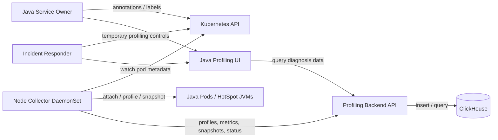
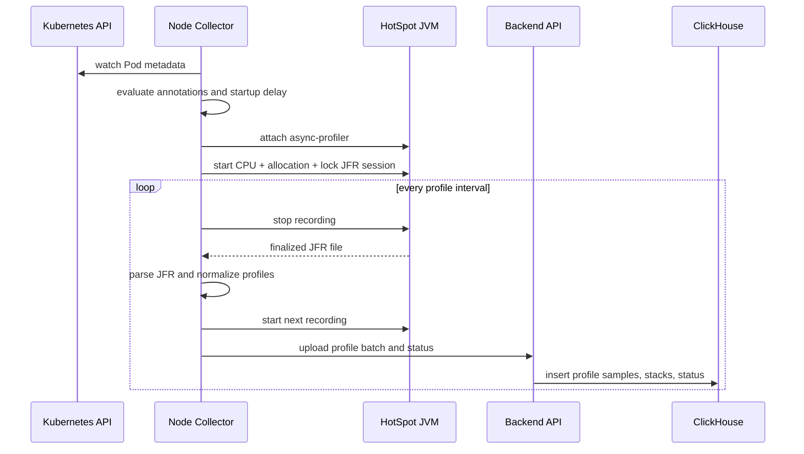
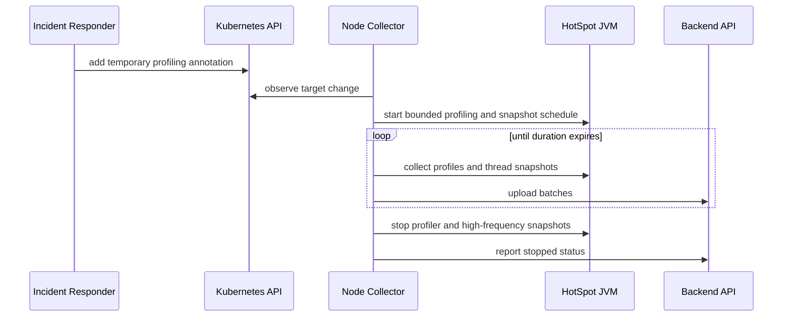
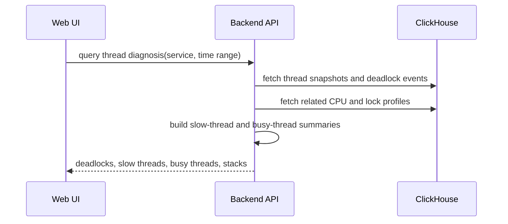

# Java Kubernetes Performance Profiling Architecture

## Architecture Summary

Build a Java-only Kubernetes performance profiling system with four deployable parts:

- Node collector: DaemonSet running on every Kubernetes node.
- Backend API: receives agent uploads and serves query APIs.
- ClickHouse storage: stores normalized profiles, JVM metrics, thread snapshots, deadlock events, and status history.
- Web UI: service-centric Java diagnosis interface.

The system is intentionally narrower than Coroot and Pyroscope. It does not own logs, tracing, service maps, or non-Java profiling. It answers these first-version questions:

- What code is allocating memory?
- Where is a Java deadlock?
- Which threads are slow or blocked?
- Which threads or Java stacks are busy?

---

## Architectural Principles

- Keep profiling domain logic independent of Kubernetes, ClickHouse, HTTP, and UI frameworks.
- Treat async-profiler profiles, JVM metrics, thread snapshots, and deadlock events as separate domain concepts.
- Keep the collector node-local because JVM attach, `/proc` inspection, and container rootfs access are node-local operations.
- Store query-ready structured data in ClickHouse; raw JFR, pprof, or thread dumps are optional short-lived debug artifacts only.
- Prefer proven libraries where license and footprint are acceptable; self-own narrow components when external tools are too heavy or license-incompatible.
- Make retention a first-class architectural concern because ClickHouse is single-node and shared with logs.

---

## C4 Context



---

## Containers

### Node Collector

Responsibilities:

- Watch local Pod metadata and resolve profiling eligibility.
- Discover Java processes on the same node.
- Confirm HotSpot-compatible JVMs.
- Detect conflicts with existing async-profiler usage.
- Deploy and control async-profiler in target containers.
- Parse JFR output into normalized profile payloads.
- Capture bounded JVM thread snapshots.
- Emit target status and collection health.
- Upload batches to the backend.

Non-responsibilities:

- No long-term local profile storage.
- No UI query serving.
- No service-map, tracing, logging, or non-Java profiling.

### Backend API

Responsibilities:

- Authenticate or authorize collector uploads if the deployment requires it.
- Validate upload payloads.
- Convert incoming data into storage records.
- Write normalized records to ClickHouse.
- Serve query APIs for service summary, time series, flamegraphs, thread snapshots, deadlocks, and target status.
- Expose storage cleanup and ingestion health.

Non-responsibilities:

- No JVM attach.
- No Kubernetes process discovery.
- No general observability query language.

### ClickHouse

Responsibilities:

- Store seven-day-or-less profile and diagnosis data.
- Support fast time-range queries by service, Pod, JVM, profile type, and stack.
- Enforce retention with TTL.
- Expose storage and cleanup health through system tables or backend health checks.

Non-responsibilities:

- No unbounded artifact archive.
- No distributed storage requirement in v1.

### Web UI

Responsibilities:

- Provide a Java-service-centric workflow.
- Show status, JVM trends, memory analysis, CPU busy analysis, lock/slow-thread analysis, deadlock details, and flamegraphs.
- Render flamegraphs from backend-provided stack-tree JSON.
- Explain unsupported questions clearly, especially retained heap analysis.

Non-responsibilities:

- No general dashboard builder.
- No log viewer.
- No tracing or topology UI.

---

## Domain Model

Use these domain terms consistently across collector, backend, storage, and UI.

### Target Identity

- Cluster
- Namespace
- Workload
- Pod
- Container
- Node
- JVM process id
- JVM start time
- Runtime vendor and version

`JVM start time` is part of identity because process ids can be reused.

### Profiling Target

A JVM that may be eligible for profiling.

Key fields:

- identity
- enablement mode: disabled, continuous, temporary
- temporary window
- startup delay state
- current status
- last failure reason

### Profile

A sampled time-range profile derived from async-profiler JFR output.

Profile types:

- Java CPU nanoseconds
- Java allocation bytes
- Java allocation objects
- Java lock contention count
- Java lock delay nanoseconds

### Stack

An ordered Java/native frame list associated with a profile sample or thread snapshot.

Key fields:

- frame order
- class
- method
- file when available
- line when available
- frame kind: Java, native, JVM, kernel, unknown

### JVM Metric Point

A time-series metric that helps interpret profiles.

Initial metric groups:

- heap usage
- GC time
- safepoint time
- allocation rate
- lock wait rate
- profiling status

### Thread Snapshot

A bounded point-in-time JVM thread-state capture.

Key fields:

- snapshot time
- thread id
- native thread id when available
- thread name
- daemon flag when available
- thread state
- stack
- lock owner
- blocked lock
- waited lock
- deadlock cycle id when detected

### Deadlock Event

A derived event from one or more thread snapshots.

Key fields:

- event time
- target identity
- cycle id
- involved threads
- locks
- blocking stack frames

---

## Backend Bounded Contexts

### Collection Control

Owns profiling enablement rules and target status.

Inputs:

- Kubernetes metadata from collectors
- collector heartbeat
- attach/profiling/snapshot status

Outputs:

- target status query result
- health and failure reason views

### Profile Ingestion

Owns upload validation and transformation from collector payloads into profile records.

Inputs:

- parsed profile batches
- profile metadata
- stack samples

Outputs:

- ClickHouse profile rows
- ingestion health

### JVM Metrics

Owns JVM trend data used by diagnosis pages.

Inputs:

- collector metric batches

Outputs:

- time-series query results
- profile-adjacent trend charts

### Thread Diagnostics

Owns thread snapshots, slow-thread summaries, busy-thread summaries, and deadlock events.

Inputs:

- thread snapshot batches
- deadlock detection output
- related CPU and lock profiles

Outputs:

- thread snapshot query results
- deadlock details
- slow-thread and busy-thread summaries

### Profile Query

Owns query-time stack aggregation for flamegraphs and top stack tables.

Inputs:

- ClickHouse profile samples
- selected time range and target filters

Outputs:

- flamegraph tree JSON
- top stack tables
- profile availability summaries

---

## Data Flow

### Continuous Profiling



### Temporary Incident Profiling



### Thread Diagnosis



---

## Collector Architecture

### Internal Components

- PodMetadataWatcher: watches Pod metadata relevant to local containers.
- TargetResolver: maps Pod metadata and local processes into profiling targets.
- EnablementPolicy: evaluates continuous, temporary, disabled, and expired states.
- HotSpotDetector: verifies JVM compatibility.
- ProfilerConflictDetector: detects existing async-profiler usage.
- AsyncProfilerController: deploys, starts, stops, and restarts async-profiler.
- JfrProfileParser: converts async-profiler JFR output into normalized profiles.
- ThreadSnapshotCollector: captures bounded thread snapshots and deadlock data.
- JvmMetricCollector: collects JVM metrics needed by trend views.
- UploadScheduler: batches and sends payloads to the backend.
- LocalStatusStore: keeps short-lived state needed for retries and status reporting.

### Collector Loop

1. Resolve candidate JVMs from local processes and Pod metadata.
2. Evaluate enablement policy.
3. Skip disabled, unsupported, conflicted, or warming targets.
4. Ensure async-profiler state matches desired target state.
5. Collect profile interval output.
6. Collect JVM metrics and configured thread snapshots.
7. Upload data with retry and bounded local buffering.
8. Report status for every target.

### Production Safeguards

- Profiling is off by default.
- Temporary profiling has mandatory expiry.
- Explicit disable wins over broader enablement.
- Collector skips JVMs with another async-profiler already loaded.
- Upload retry buffer is bounded.
- Thread snapshot frequency is lower for continuous mode than temporary mode.
- Raw artifacts are deleted after parsing unless short-lived debug capture is explicitly enabled.

---

## Backend Architecture

Use a layered shape:

```text
transport/http
  -> application/usecases
    -> domain
      -> ports
        -> infrastructure/clickhouse
```

### HTTP Transport

The HTTP layer should only:

- parse requests
- validate coarse request shape
- call use cases
- map use-case output to responses

It should not contain ClickHouse SQL, stack aggregation, or profiling rules.

### Application Use Cases

Initial use cases:

- IngestProfileBatch
- IngestJvmMetricBatch
- IngestThreadSnapshotBatch
- IngestTargetStatusBatch
- QueryServiceSummary
- QueryJvmTrends
- QueryFlamegraph
- QueryThreadDiagnosis
- QueryDeadlockDetails
- QueryStorageHealth

### Domain Services

Initial domain services:

- ProfileTypeCatalog: owns valid profile types and units.
- StackNormalizer: creates stable stack and frame representations.
- FlamegraphBuilder: builds tree JSON from stack samples.
- SlowThreadAnalyzer: classifies blocked and waiting threads.
- BusyThreadAnalyzer: correlates RUNNABLE snapshots with CPU profile evidence.
- DeadlockDetectorResultMapper: normalizes JVM deadlock output.
- RetentionPolicy: defines maximum retention windows and raw artifact limits.

### Ports

Use explicit interfaces for infrastructure:

- ProfileRepository
- JvmMetricRepository
- ThreadSnapshotRepository
- DeadlockEventRepository
- TargetStatusRepository
- StorageHealthRepository

This prevents ClickHouse query details from leaking into controllers or UI code.

---

## ClickHouse Storage Design

This is a logical schema direction, not a final migration script.

### Tables

#### profile_samples

Purpose: store sampled profile values with stack identity and target identity.

Important dimensions:

- timestamp bucket
- cluster
- namespace
- workload
- pod
- container
- node
- jvm pid
- jvm start time
- profile type
- stack id
- value

Retention: 7 days.

#### profile_stacks

Purpose: map stack id to ordered frames.

Important dimensions:

- stack id
- frame index
- class
- method
- file
- line
- frame kind

Retention: 7 days or reference-compatible TTL with profile samples.

#### jvm_metric_points

Purpose: store trend data used by service and JVM views.

Important dimensions:

- timestamp
- target identity
- metric name
- metric value
- unit

Retention: 7 days.

#### thread_snapshots

Purpose: store one row per thread in a snapshot.

Important dimensions:

- snapshot id
- timestamp
- target identity
- thread id
- native thread id
- thread name
- daemon flag
- thread state
- stack id
- lock owner thread id
- blocked lock
- waited lock
- deadlock cycle id

Retention: 7 days.

#### deadlock_events

Purpose: store derived deadlock cycles for direct UI lookup.

Important dimensions:

- event id
- timestamp
- target identity
- cycle id
- involved thread ids
- involved lock ids
- representative stack ids

Retention: 7 days.

#### target_status_history

Purpose: store current and recent profiling/snapshot status.

Important dimensions:

- timestamp
- target identity
- desired state
- actual state
- reason
- collector node

Retention: 7 days.

#### artifact_index

Purpose: optional index for short-lived raw artifacts when debug mode is enabled.

Important dimensions:

- artifact id
- target identity
- artifact type
- object path or local reference
- created at
- expires at

Retention: disabled by default; 24 hours maximum when enabled.

### Partitioning and TTL Direction

- Partition by day.
- Order by target identity, profile type, timestamp, and stack id for profile samples.
- Order by target identity, timestamp, and thread state for thread snapshots.
- Use ClickHouse TTL for every table containing collected data.
- Query storage health through table size, part count, oldest row timestamp, and TTL lag.

---

## Query API Shape

Initial API capabilities:

- List Java services with profiling status.
- Get service summary for a time range.
- Get JVM trend series.
- Get flamegraph for profile type and target filter.
- Get top stacks for profile type and target filter.
- Get thread diagnosis summary.
- Get deadlock details.
- Get target status history.
- Get storage cleanup health.

API responses should return product-shaped data, not raw ClickHouse rows. For example, flamegraph responses should return a tree with values and frame labels, while thread diagnosis should return classified deadlock, slow-thread, and busy-thread sections.

---

## Web UI Architecture

### Pages

- Service Overview: status, enabled targets, JVM trend summary, recent anomalies.
- Memory: heap and GC charts, allocation rate, allocation flamegraphs, top allocators.
- CPU / Busy Threads: CPU flamegraph, busy thread table, current stack samples.
- Locks / Slow Threads: lock delay flamegraph, blocked/waiting thread table, blocking stacks.
- Deadlocks: deadlock events, cycle details, involved locks and stack frames.
- Target Status: per-Pod/JVM profiler and snapshot status with failure reasons.
- Storage Health: retention, oldest row, table size, TTL lag.

### Component Boundaries

- API client: owns HTTP calls and response decoding.
- Feature modules: memory, CPU, locks, threads, status, storage health.
- Chart components: trend chart, flamegraph, stack trace panel.
- View state: selectors for namespace, service, Pod, container, JVM, profile type, and time range.

UI components should not know ClickHouse schema or collector internals.

---

## Operational Model

### Kubernetes Controls

The exact annotation names are deferred, but the architecture expects these controls:

- continuous profiling enabled
- temporary profiling enabled
- temporary duration
- startup delay override
- explicit disable
- thread snapshot mode or frequency override

Precedence:

1. Explicit disable.
2. Temporary profiling if active and not expired.
3. Continuous profiling if enabled.
4. Default disabled.

### Health Signals

Collector health:

- discovered JVM count
- eligible target count
- active profiler count
- skipped unsupported count
- skipped conflict count
- attach failures
- upload failures
- last successful upload time

Backend health:

- ingestion success and failure counts
- ClickHouse insert latency
- ClickHouse query latency
- oldest retained row per table
- TTL lag per table
- table size and part count

### Failure Handling

- Attach failure: mark target failed with reason and retry with backoff.
- Unsupported JVM: mark skipped until process identity changes.
- async-profiler conflict: mark skipped while conflict remains.
- Backend unavailable: buffer locally within a fixed size and drop oldest data when full.
- ClickHouse insert failure: reject batch with retryable status when safe.
- Query timeout: return partial availability metadata rather than hanging UI requests.

---

## Security and Permissions

The collector requires elevated node-local visibility. The exact Kubernetes manifest is a planning task, but the architecture assumes:

- access to host process information
- ability to map container root filesystems
- permission to attach to eligible JVMs
- read access to Pod metadata
- network access to backend API

Security boundaries:

- Only annotated or labeled targets are profiled.
- Explicit disable always wins.
- Raw artifacts are disabled by default.
- Upload payloads should not include heap dumps or arbitrary application memory.
- Backend should treat stack traces as sensitive production data and avoid exposing cross-namespace data without authorization.

---

## Dependency Direction

Recommended dependency direction:

```text
UI -> Backend API -> Application Use Cases -> Domain -> Ports
                                              Ports -> ClickHouse Adapter

Collector -> Collector Application -> Collector Domain -> JVM/K8s/HTTP Adapters
```

Domain code should not import:

- HTTP framework packages
- ClickHouse drivers
- Kubernetes clients
- frontend framework code
- async-profiler process-control code

Infrastructure adapters may import external libraries and translate them into domain-shaped records.

---

## Key Architecture Decisions

### ADR-001: Use DaemonSet Collector

Decision: use a DaemonSet collector as the only v1 collection shape.

Reason: Java process discovery, JVM attach, async-profiler deployment, and `/proc/<pid>/root` reads are node-local operations. A DaemonSet is simpler and safer than remote attach jobs.

### ADR-002: Store Structured Profiles in ClickHouse

Decision: normalize profiles into ClickHouse tables instead of depending on Pyroscope, Parca, or Grafana.

Reason: the target environment already has ClickHouse, and external profile backends are either too heavy or license-incompatible for this product direction.

### ADR-003: Pair async-profiler with Thread Snapshots

Decision: use async-profiler for sampled CPU, allocation, and lock profiles; use thread snapshots for deadlock and current thread-state diagnosis.

Reason: profiles answer cost over time, while thread snapshots answer current blocking relationships and deadlock cycles. Neither source alone answers all required questions.

### ADR-004: Self-Owned Viewing Layer

Decision: build a narrow Java profiling UI and self-owned flamegraph renderer unless a small permissively licensed dependency passes review.

Reason: the product needs only a focused diagnosis workflow, not a general observability console.

### ADR-005: Hard Retention Ceiling

Decision: no collected data type may be retained for more than 7 days.

Reason: the ClickHouse deployment is single-node and shared with logs, so storage growth must be bounded from v1.

---

## Implementation Sequence

1. Define collector/backend payload contracts and ClickHouse logical schema.
2. Build backend ingestion for target status, JVM metrics, and profile samples.
3. Build ClickHouse TTL, storage health checks, and query repositories.
4. Build collector target discovery and enablement policy without profiling.
5. Add async-profiler control and JFR parsing.
6. Add thread snapshot capture and deadlock event normalization.
7. Add backend query APIs for trends, flamegraphs, thread diagnosis, and status.
8. Build the minimal service-centric Web UI.
9. Add production safeguards, retry limits, and operational dashboards.

---

## Architecture Risks

- JVM attach permissions may vary by Kubernetes runtime and security policy.
- Thread snapshot mechanism choice affects overhead and implementation complexity.
- ClickHouse storage volume can grow quickly if stack cardinality is not controlled.
- Flamegraph query latency can become high without pre-aggregation or careful ordering.
- Stack traces may expose sensitive package names or business logic.
- async-profiler behavior can differ across JDK versions and container configurations.

Mitigations:

- Keep profiling opt-in and temporary profiling bounded.
- Record unsupported and failed states explicitly.
- Use short TTLs and storage health from the start.
- Normalize stacks and avoid storing raw artifacts by default.
- Add query limits and timeouts to every user-facing query.

---

## Planning Follow-Ups

- Define exact Kubernetes annotation names and precedence rules.
- Choose thread snapshot implementation path.
- Define concrete ClickHouse DDL and indexes/order keys.
- Define upload payload schemas and API endpoints.
- Define flamegraph JSON format.
- Define UI wireframes for memory, CPU, lock, deadlock, and status views.
- Define collector Kubernetes permissions and security posture.
