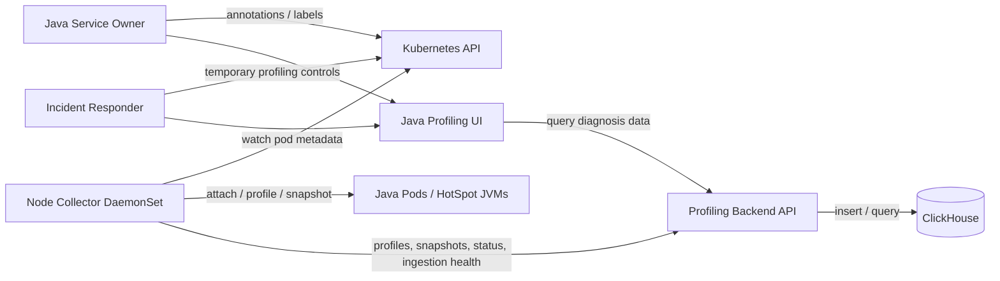
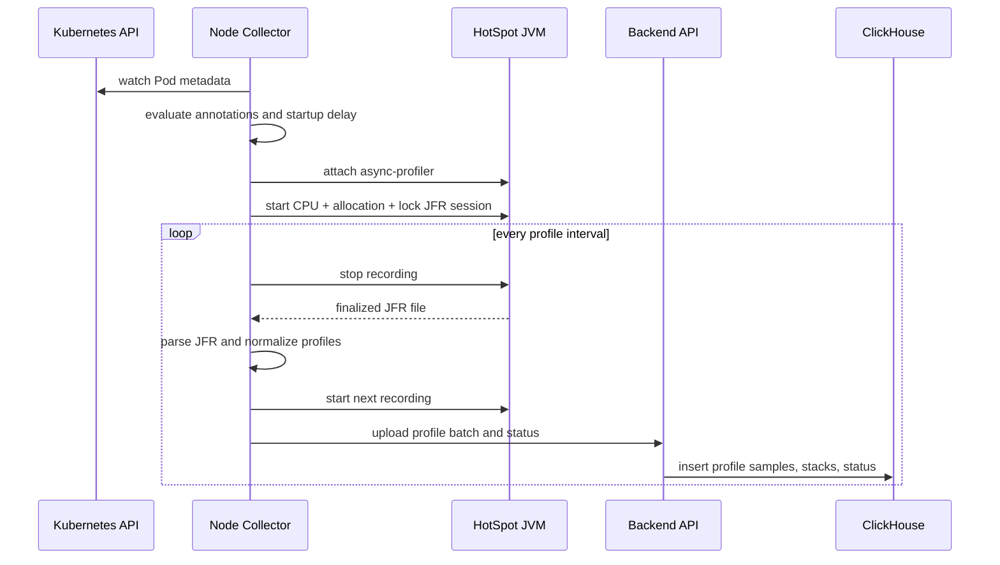
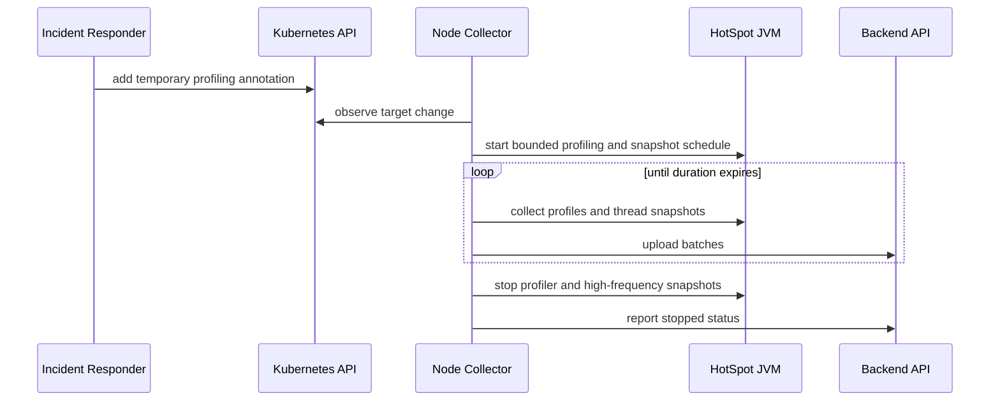
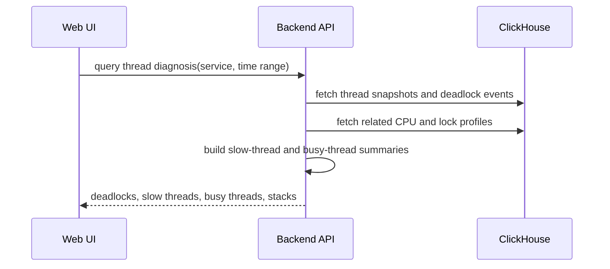

# Java Profiler Architecture

## Architecture Summary

Build a Java-only Kubernetes performance profiling system with four deployable parts:

- Node collector: DaemonSet running on every Kubernetes node.
- Backend API: receives agent uploads and serves query APIs.
- ClickHouse storage: stores normalized profiles, thread snapshots, deadlock events, target status, and ingestion health.
- Web UI: service-centric Java diagnosis interface.

The system is intentionally narrower than Coroot and Pyroscope. It does not own logs, tracing, service maps, or non-Java profiling. It answers these first-version questions:

- What code is allocating memory?
- Where is a Java deadlock?
- Which threads are slow or blocked?
- Which threads or Java stacks are busy?

### V1 Delivery Slice

The first implementation should ship as a vertical slice, not as all conceptual components at once.

```text
Slice 1: target status + ingestion health + profile ingestion + ClickHouse TTL
Slice 2: async-profiler lifecycle + CPU/allocation/lock flamegraph queries
Slice 3: ThreadMXBean snapshots + deadlock events + slow/busy thread summaries
Slice 4: minimal service-centric UI + packaging
```

This keeps the first usable system small while preserving the final architecture. The conceptual boundaries below are still valid, but they are not a mandate to create one class or service per bullet on day one.

---

## Architectural Principles

- Keep profiling domain logic independent of Kubernetes, ClickHouse, HTTP, and UI frameworks.
- Treat async-profiler profiles, thread snapshots, deadlock events, target status, and ingestion health as separate domain concepts.
- Keep the collector node-local because JVM attach, `/proc` inspection, and container rootfs access are node-local operations.
- Store query-ready structured data in ClickHouse; raw JFR, pprof, or thread dumps are optional short-lived debug artifacts only.
- Prefer proven libraries where license and footprint are acceptable; self-own narrow components when external tools are too heavy or license-incompatible.
- Make retention a first-class architectural concern because ClickHouse is single-node and shared with logs.

---

## C4 Context



---

## Containers

### Node Collector

Responsibilities:

- Watch local Pod metadata and resolve profiling eligibility.
- Discover Java processes on the same node.
- Confirm HotSpot-compatible JVMs.
- Detect conflicts with existing async-profiler usage.
- Deploy and control async-profiler in target containers.
- Parse JFR output into normalized profile payloads.
- Capture bounded JVM thread snapshots.
- Emit target status and collection health.
- Upload batches to the backend.

Non-responsibilities:

- No long-term local profile storage.
- No UI query serving.
- No service-map, tracing, logging, or non-Java profiling.

### Backend API

Responsibilities:

- Authenticate collector uploads.
- Authorize UI queries by namespace and service scope.
- Validate upload payloads.
- Convert incoming data into storage records.
- Write normalized records to ClickHouse.
- Serve query APIs for service summary, flamegraphs, thread snapshots, deadlocks, target status, and ingestion health.
- Expose storage cleanup state through exporter metrics and bounded status APIs.

Non-responsibilities:

- No JVM attach.
- No Kubernetes process discovery.
- No general observability query language.

### ClickHouse

Responsibilities:

- Store seven-day-or-less profile and diagnosis data.
- Support fast time-range queries by service, Pod, JVM, profile type, and stack.
- Enforce retention with TTL.
- Expose storage and cleanup health through backend exporter metrics derived from ClickHouse system tables.

Non-responsibilities:

- No unbounded artifact archive.
- No distributed storage requirement in v1.

### Web UI

Responsibilities:

- Provide a Java-service-centric workflow.
- Show status, memory allocation profiles, CPU busy analysis, lock/slow-thread analysis, deadlock details, and flamegraphs.
- Render flamegraphs from backend-provided stack-tree JSON.
- Explain unsupported questions clearly, especially retained heap analysis.

Non-responsibilities:

- No general dashboard builder.
- No log viewer.
- No tracing or topology UI.

---

## Metrics Boundary

Metrics are exporter-only in this project.

- Collector and backend expose Prometheus-compatible scrape endpoints.
- Prometheus-series services own metric storage, dashboards, alerting, and retention.
- This project does not store Prometheus-style time series in ClickHouse.
- This project does not render JVM or service metric dashboards.
- The UI may link to existing Prometheus dashboards with matching namespace, service, Pod, and time-range context.

ClickHouse stores profile and diagnosis data only: profiles, stacks, thread snapshots, deadlock events, target status, ingestion batches, and optional short-lived artifact indexes.

---

## Domain Model

Use these domain terms consistently across collector, backend, storage, and UI.

### Target Identity

- Cluster
- Namespace
- Workload
- Pod
- Container
- Node
- JVM process id
- JVM start time
- Runtime vendor and version

`JVM start time` is part of identity because process ids can be reused.

### Profiling Target

A JVM that may be eligible for profiling.

Key fields:

- identity
- enablement mode: disabled, continuous, temporary
- temporary window
- startup delay state
- current status
- last failure reason

### Profile

A sampled time-range profile derived from async-profiler JFR output.

Profile types:

- Java CPU nanoseconds
- Java allocation bytes
- Java allocation objects
- Java lock contention count
- Java lock delay nanoseconds

### Stack

An ordered Java/native frame list associated with a profile sample or thread snapshot.

Key fields:

- frame order
- class
- method
- file when available
- line when available
- frame kind: Java, native, JVM, kernel, unknown

### Exported Metric

A Prometheus-scraped metric exposed by the collector or backend exporter.

Metrics are not stored in ClickHouse by this system and are not rendered as dashboards in this UI. Prometheus-series services own metric storage, query, dashboards, and alerting.

Initial exporter metric groups:

- target discovery and status counters
- profiler active/disabled/failed status
- attach and profiler failure counters
- upload success, retry, and dropped-batch counters
- backend ingestion success and failure counters
- ClickHouse insert/query health counters and latency summaries

### Thread Snapshot

A bounded point-in-time JVM thread-state capture.

Key fields:

- snapshot time
- thread id
- native thread id when available
- thread name
- daemon flag when available
- thread state
- stack
- lock owner
- blocked lock
- waited lock
- deadlock cycle id when detected
- per-thread CPU time when available
- per-thread user CPU time when available
- blocked time and waited time when contention monitoring is available and explicitly enabled

V1 mechanism:

- Use a small dynamically attached JVM helper that reads `java.lang.management.ThreadMXBean`.
- Use `dumpAllThreads(lockedMonitors=true, lockedSynchronizers=true)` or equivalent bounded-depth APIs for structured stack and lock data.
- Use `findDeadlockedThreads()` for monitor and ownable-synchronizer deadlock detection.
- Use per-thread CPU time deltas for busy-thread ranking when supported by the JVM.
- Do not parse text thread dumps as the primary source. Text dumps are a fallback/debug path only.
- Do not enable thread contention monitoring by default. It can be enabled only for temporary profiling windows because some JVMs may treat it as expensive.

### Deadlock Event

A derived event from one or more thread snapshots.

Key fields:

- event time
- target identity
- cycle id
- involved threads
- locks
- blocking stack frames

### Busy Thread Summary

A derived result that ranks threads by observed CPU delta and stack evidence.

Key fields:

- target identity
- time range
- thread id
- native thread id when available
- thread name
- CPU delta nanoseconds when available
- RUNNABLE snapshot count
- representative stack ids
- related CPU profile stack ids when correlation is possible
- confidence: exact thread CPU, sampled RUNNABLE state, or profile-only hotspot

The UI must distinguish thread-level CPU evidence from profile-level stack hotspots. If async-profiler samples do not carry stable thread identity, the UI must not claim that a specific thread owns a CPU hotspot.

---

## Backend Bounded Contexts

### Collection Control

Owns profiling enablement rules and target status.

Inputs:

- Kubernetes metadata from collectors
- collector heartbeat
- attach/profiling/snapshot status

Outputs:

- target status query result
- health and failure reason views

### Profile Ingestion

Owns upload validation and transformation from collector payloads into profile records.

Inputs:

- parsed profile batches
- profile metadata
- stack samples

Outputs:

- ClickHouse profile rows
- ingestion health

### Exporter Metrics

Owns metric exposure only.

Inputs:

- collector status
- profiler lifecycle events
- upload and ingestion health
- backend storage/query health

Outputs:

- Prometheus scrape endpoints
- metric labels aligned with service, namespace, Pod, container, JVM, node, and status reason

### Thread Diagnostics

Owns thread snapshots, slow-thread summaries, busy-thread summaries, and deadlock events.

Inputs:

- thread snapshot batches
- deadlock detection output
- related CPU and lock profiles

Outputs:

- thread snapshot query results
- deadlock details
- slow-thread and busy-thread summaries

### Profile Query

Owns query-time stack aggregation for flamegraphs and top stack tables.

Inputs:

- ClickHouse profile samples
- selected time range and target filters

Outputs:

- flamegraph tree JSON
- top stack tables
- profile availability summaries

---

## Data Flow

### Continuous Profiling



### Temporary Incident Profiling



### Thread Diagnosis



---

## Collector Architecture

### Internal Components

- PodMetadataWatcher: watches Pod metadata relevant to local containers.
- TargetResolver: maps Pod metadata and local processes into profiling targets.
- EnablementPolicy: evaluates continuous, temporary, disabled, and expired states.
- HotSpotDetector: verifies JVM compatibility.
- ProfilerConflictDetector: detects existing async-profiler usage.
- AsyncProfilerController: deploys, starts, stops, and restarts async-profiler.
- JfrProfileParser: converts async-profiler JFR output into normalized profiles.
- ThreadSnapshotCollector: captures bounded thread snapshots and deadlock data.
- MetricsExporter: exposes collector status, profiler status, upload health, and failure counters for Prometheus scraping.
- UploadScheduler: batches and sends payloads to the backend.
- LocalStatusStore: keeps short-lived state needed for retries and status reporting.

These are conceptual components. Initial implementation may group them into fewer files or packages as long as the dependency direction and tests stay clear.

### Collector Reference Strategy

Use Coroot node-agent as the primary implementation reference for node-local Java profiling mechanics:

- Kubernetes Pod discovery
- local JVM process discovery
- HotSpot detection
- Attach API usage
- async-profiler lifecycle
- async-profiler conflict detection
- bounded local buffering
- upload behavior

Use OpenTelemetry Collector only as an architectural reference for internal collector boundaries:

- receiver-like discovery
- processor-like normalization
- exporter-like upload
- batching and retry
- queue limits and backpressure
- health and metrics endpoints
- pipeline lifecycle

Do not depend on OpenTelemetry Collector as the v1 runtime collector framework. The product collects Java profiles and thread diagnostics, not generic OTLP telemetry, and a custom lightweight collector keeps permissions, footprint, and failure behavior easier to control.

### Collector Loop

1. Resolve candidate JVMs from local processes and Pod metadata.
2. Evaluate enablement policy.
3. Skip disabled, unsupported, conflicted, or warming targets.
4. Ensure async-profiler state matches desired target state.
5. Collect profile interval output.
6. Collect configured thread snapshots and update exporter metrics.
7. Upload data with retry and bounded local buffering.
8. Report status for every target.

### Production Safeguards

- Profiling is off by default.
- Temporary profiling has mandatory expiry.
- Explicit disable wins over broader enablement.
- Collector skips JVMs with another async-profiler already loaded.
- Upload retry buffer is bounded.
- Upload retry buffer records dropped batch counts and oldest dropped timestamp when full.
- Thread snapshot frequency is lower for continuous mode than temporary mode.
- Raw artifacts are deleted after parsing unless short-lived debug capture is explicitly enabled.

---

## Backend Architecture

### Backend Technology Selection

The backend and collector runtime language is Go.

Required stack:

- Language/runtime: Go 1.23 or newer.
- HTTP server: Go standard `net/http`.
- Routing: standard `net/http` `ServeMux` first; use `go-chi/chi` only if route grouping, middleware composition, or path variables become awkward with the standard router.
- ClickHouse driver: official `github.com/ClickHouse/clickhouse-go/v2`.
- Kubernetes client: `k8s.io/client-go` for collector Pod metadata watches.
- Metrics exporter: `github.com/prometheus/client_golang`.
- JFR parsing: prefer `github.com/grafana/jfr-parser` after license and compatibility checks.
- Configuration: typed Go config loaded from environment variables and optional config file; avoid dynamic runtime scripting.

Do not use in v1:

- OpenTelemetry Collector as the runtime collector framework.
- Gin, Echo, Fiber, or other full web frameworks unless a concrete implementation blocker appears.
- ORM layers for ClickHouse.
- Generic `utils`, `helpers`, or `common` packages as dumping grounds.

Backend and collector code must follow Clean Architecture boundaries:

- `domain`: target identity, profile types, status reasons, stack model, retention rules, query result models.
- `app`: use cases such as ingest profile batch, query flamegraph, query thread diagnosis, and report target status.
- `ports`: repository, clock, auth, exporter, and backend-client interfaces.
- `infrastructure`: ClickHouse, HTTP transport, Kubernetes, JVM attach, filesystem, async-profiler, JFR parser, and Prometheus adapters.

The HTTP layer should remain thin: parse, authenticate, authorize, validate coarse request shape, call a use case, and map results to responses. It must not own ClickHouse SQL, JVM attach behavior, stack aggregation, or profiling policy.

Use a layered shape:

```text
transport/http
  -> application/usecases
    -> domain
      -> ports
        -> infrastructure/clickhouse
```

### HTTP Transport

The HTTP layer should only:

- parse requests
- validate coarse request shape
- call use cases
- map use-case output to responses

It should not contain ClickHouse SQL, stack aggregation, or profiling rules.

### Application Use Cases

Initial use cases:

- IngestProfileBatch
- IngestThreadSnapshotBatch
- IngestTargetStatusBatch
- IngestCollectorHeartbeat
- QueryServiceSummary
- QueryFlamegraph
- QueryThreadDiagnosis
- QueryDeadlockDetails
- QueryIngestionHealth
- QueryRetentionStatus

### Domain Services

Initial domain services:

- ProfileTypeCatalog: owns valid profile types and units.
- StackNormalizer: creates stable stack and frame representations.
- FlamegraphBuilder: builds tree JSON from stack samples.
- SlowThreadAnalyzer: classifies blocked and waiting threads.
- BusyThreadAnalyzer: correlates RUNNABLE snapshots with CPU profile evidence.
- DeadlockDetectorResultMapper: normalizes JVM deadlock output.
- RetentionPolicy: defines maximum retention windows and raw artifact limits.
- BatchIdempotencyPolicy: rejects invalid duplicate batches and safely accepts retry duplicates.

### Ports

Use explicit interfaces for infrastructure:

- ProfileRepository
- ThreadSnapshotRepository
- DeadlockEventRepository
- TargetStatusRepository
- RetentionStatusRepository
- IngestionBatchRepository

This prevents ClickHouse query details from leaking into controllers or UI code.

---

## ClickHouse Storage Design

This is a logical schema direction, not a final migration script.

### Tables

#### ingestion_batches

Purpose: make collector uploads idempotent and observable.

Important dimensions:

- batch id
- collector id
- target identity
- batch type
- first seen timestamp
- last seen timestamp
- status
- row counts
- error reason

Retention: 7 days.

#### profile_samples

Purpose: store sampled profile values with stack identity and target identity.

Important dimensions:

- timestamp bucket
- cluster
- namespace
- workload
- pod
- container
- node
- jvm pid
- jvm start time
- profile type
- stack id
- value

Retention: 7 days.

#### profile_rollups

Purpose: pre-aggregate common flamegraph and top-stack query ranges.

Important dimensions:

- time bucket
- target identity
- profile type
- stack id
- summed value
- sample count

Retention: 7 days.

#### profile_stacks

Purpose: map stack id to ordered frames.

Important dimensions:

- stack id
- frame index
- class
- method
- file
- line
- frame kind

Retention: 7 days or reference-compatible TTL with profile samples.

#### thread_snapshots

Purpose: store one row per thread in a snapshot.

Important dimensions:

- snapshot id
- timestamp
- target identity
- thread id
- native thread id
- thread name
- daemon flag
- thread state
- stack id
- lock owner thread id
- blocked lock
- waited lock
- deadlock cycle id

Retention: 7 days.

#### deadlock_events

Purpose: store derived deadlock cycles for direct UI lookup.

Important dimensions:

- event id
- timestamp
- target identity
- cycle id
- involved thread ids
- involved lock ids
- representative stack ids

Retention: 7 days.

#### target_status_history

Purpose: store current and recent profiling/snapshot status.

Important dimensions:

- timestamp
- target identity
- desired state
- actual state
- reason
- collector node

Retention: 7 days.

#### artifact_index

Purpose: optional index for short-lived raw artifacts when debug mode is enabled.

Important dimensions:

- artifact id
- target identity
- artifact type
- object path or local reference
- created at
- expires at

Retention: disabled by default; 24 hours maximum when enabled.

### Partitioning and TTL Direction

- Partition by day.
- Do not partition by namespace, service, Pod, JVM, profile type, stack id, or tenant-like labels.
- Order by target identity, profile type, timestamp, and stack id for profile samples.
- Order by target identity, timestamp, and thread state for thread snapshots.
- Use ClickHouse TTL for every table containing collected data.
- Export storage health metrics through the backend exporter using table size, part count, oldest row timestamp, and TTL lag.
- Use stable stack hashing so repeated stacks reuse the same stack id within the retention window.
- Enforce maximum frames per stack, maximum stacks per query, and maximum samples scanned per user-facing request.
- Use materialized views or scheduled rollup jobs for common flamegraph ranges if raw sample queries exceed the query budget.

### Query Budgets

Initial user-facing budgets:

- Flamegraph query: p95 under 3 seconds for one service, one profile type, one hour.
- Thread diagnosis query: p95 under 2 seconds for one service and one hour.

If a query exceeds its budget, the backend should return a bounded partial result with an explicit warning instead of letting the UI spin indefinitely.

---

## Query API Shape

Initial API capabilities:

- List Java services with profiling status.
- Get service summary for a time range.
- Get flamegraph for profile type and target filter.
- Get top stacks for profile type and target filter.
- Get thread diagnosis summary.
- Get deadlock details.
- Get target status history.
- Get ingestion and target status.
- Get retention status for collected profile and diagnosis data.

API responses should return product-shaped data, not raw ClickHouse rows. For example, flamegraph responses should return a tree with values and frame labels, while thread diagnosis should return classified deadlock, slow-thread, and busy-thread sections.

Every list or tree query must accept explicit limits. Every response that is truncated, sampled, partially failed, or missing a data source must say so in machine-readable metadata and user-facing copy.

---

## Web UI Architecture

### Pages

- Service Overview: status, enabled targets, recent profile availability, and links to existing Prometheus dashboards when configured.
- Memory: allocation flamegraphs and top allocators.
- CPU / Busy Threads: CPU flamegraph, busy thread table, current stack samples.
- Locks / Slow Threads: lock delay flamegraph, blocked/waiting thread table, blocking stacks.
- Deadlocks: deadlock events, cycle details, involved locks and stack frames.
- Target Status: per-Pod/JVM profiler and snapshot status with failure reasons.

### Component Boundaries

- API client: owns HTTP calls and response decoding.
- Feature modules: memory, CPU, locks, threads, status, and ingestion health.
- Visualization components: flamegraph and stack trace panel.
- View state: selectors for namespace, service, Pod, container, JVM, profile type, and time range.

UI components should not know ClickHouse schema or collector internals.

### Frontend Technology Selection

Use a small SPA for v1. The selection is based on the product's actual UI needs, not on a preselected chart library.

#### Frontend Requirements

The UI must support:

- Profile flamegraphs for a selected service, target, profile type, and time range.
- Optional links to existing Prometheus dashboards for metric context, without rendering metric charts in this UI.
- Flamegraph rendering with zoom, search, stack reversal, top table, and partial-result warnings.
- Thread diagnosis tables for deadlocks, slow threads, busy threads, and stack trace panels.
- URL-shareable filters: namespace, service, Pod, container, JVM, profile type, and time range.
- Clear loading, empty, error, partial-result, truncated-result, and unauthorized states.
- Commercial-friendly distribution with no AGPL or source-available runtime dependency.
- Static asset packaging inside Kubernetes.

#### Candidate Evaluation

```text
Need                         Better fit                          Not default
---------------------------  ----------------------------------  ------------------------------
SPA shell                    React + TypeScript + Vite           Next.js, SSR frameworks
URL state                    React Router search params          Custom global router state
Backend server state         TanStack Query                      Hand-written fetch cache
Flamegraph                   Self-owned SVG/Canvas renderer      Generic charting libraries
Dialogs/tabs/popovers        Radix UI primitives                 Large admin templates
Tables                       Native table first                  Heavy data-grid dependency
Local UI state               React local state                   Redux
Tests                        Vitest + Playwright                 Browser-only manual QA
```

#### Recommended V1 Stack

- Language: TypeScript.
- Runtime UI: React.
- Build tool: Vite.
- Routing: React Router, using URL search params as the source of truth for namespace, service, Pod, JVM, profile type, and time range.
- Server state: TanStack Query for backend API fetching, caching, retries, request cancellation, and loading/error states.
- Local UI state: React local state first. Do not add Redux. Add Zustand only if cross-page client state becomes real.
- Flamegraph: self-owned SVG or Canvas renderer over backend-provided flamegraph-tree JSON.
- Tables and primitives: native semantic HTML first; Radix UI primitives for accessible dialogs, popovers, tabs, menus, and tooltips.
- Styling: plain CSS or CSS Modules with CSS variables. Keep the visual system self-owned.
- Testing: Vitest for unit/component tests and Playwright for browser flows.
- Packaging: static assets served by the backend or a small nginx container.

#### Metrics Dashboard Decision

Do not add a time-series chart library in v1.

Reason:

- JVM and service metrics already have dashboards in the Prometheus ecosystem.
- This product owns profiling and thread diagnosis, not metric storage or metric visualization.
- Collector and backend metrics are exposed through exporter endpoints and observed by Prometheus-series services.
- The UI may provide links into existing dashboards, but must not duplicate those charts.

If the scope changes later and this product must render metric charts itself, evaluate a chart library at that time from the new requirements. Do not carry a time-series charting package as a v1 runtime dependency.

#### Flamegraph Decision

Do not use generic charting libraries for flamegraphs.

The flamegraph renderer should be self-owned because the required behavior is profiling-specific:

- stack-tree layout
- frame search
- zoom into frame
- stack reversal
- compare/diff coloring later
- partial-result and truncated-result warnings
- profile-type-specific units and colors

Existing flamegraph packages can be studied or used in a prototype, but v1 should not bind the product to a third-party profile viewer's data model.

#### Do Not Use In V1

- Next.js or other SSR framework: the product is an authenticated internal console, not SEO content.
- Grafana panels or Pyroscope UI embedding: this violates the self-owned viewing-layer direction.
- Direct ClickHouse access from the browser: all queries go through the backend authorization and query-budget layer.
- Redux: there is no complex client-side domain state yet.
- Large admin templates: they add surface area before the UI proves its shape.

#### License Posture

- Prefer MIT, ISC, BSD, or Apache-2.0 dependencies.
- Reject AGPL or source-available-only UI dependencies for required runtime paths.
- Generate and publish bundled frontend dependency notices as part of the release artifact.

---

## Operational Model

### Kubernetes Controls

The exact annotation names are deferred, but the architecture expects these controls:

- continuous profiling enabled
- temporary profiling enabled
- temporary duration
- startup delay override
- explicit disable
- thread snapshot mode or frequency override

Precedence:

1. Explicit disable.
2. Temporary profiling if active and not expired.
3. Continuous profiling if enabled.
4. Default disabled.

### Health Signals

Collector health:

- discovered JVM count
- eligible target count
- active profiler count
- skipped unsupported count
- skipped conflict count
- attach failures
- upload failures
- last successful upload time

Backend health:

- ingestion success and failure counts
- ClickHouse insert latency
- ClickHouse query latency
- oldest retained row per table
- TTL lag per table
- table size and part count
- upload batches dropped by collectors
- duplicate upload batches accepted or rejected

These are exporter metrics only. Prometheus-series services own retention, dashboards, and alerting for them.

### Failure Handling

- Attach failure: mark target failed with reason and retry with backoff.
- Unsupported JVM: mark skipped until process identity changes.
- async-profiler conflict: mark skipped while conflict remains.
- Backend unavailable: buffer locally within a fixed size and drop oldest data when full.
- ClickHouse insert failure: reject batch with retryable status when safe.
- Query timeout: return partial availability metadata rather than hanging UI requests.
- Busy-thread correlation unavailable: show CPU flamegraph and RUNNABLE snapshot evidence separately, with confidence marked as profile-only or snapshot-only.

### Failure Mode Matrix

| Component | Failure mode | Detection | Required behavior |
|-----------|--------------|-----------|-------------------|
| Collector discovery | Pod metadata is stale or container pid mapping fails | target status reason, discovery error counter | mark target unknown or skipped; do not attach |
| Collector attach | JVM attach socket unavailable, permission denied, or process exits mid-attach | attach failure counter, target status reason | retry with backoff; do not loop aggressively |
| AsyncProfiler lifecycle | profiler start succeeds but stop or JFR finalization fails | profiler command failure counter, missing interval marker | report partial interval; restart profiler only after cooldown |
| AsyncProfiler conflict | another profiler is already loaded | maps scan result, conflict status | skip target until process identity changes or conflict disappears |
| JFR parsing | parser rejects incomplete or incompatible JFR | parse failure counter, batch error reason | discard artifact, mark interval failed, keep target eligible |
| Thread snapshots | helper attach works but `ThreadMXBean` call is slow or unavailable | snapshot timeout, unsupported capability flag | skip snapshot path; keep async-profiler profiles running |
| Local buffering | backend unavailable and buffer fills | buffer byte usage, dropped batch counter | drop oldest data; expose oldest dropped timestamp |
| Upload | backend rejects duplicate or malformed batch | upload response status, ingestion batch status | retry only retryable errors; do not retry invalid batches |
| Backend ingestion | ClickHouse insert timeout or schema validation failure | ingestion failure counter, batch status | reject retryable inserts safely; preserve idempotency |
| Rollups | materialized view or rollup job lags raw samples | rollup freshness metric | query raw data within scan budget or return partial result |
| Query API | flamegraph or thread query exceeds budget | timeout, scan limit, node limit metadata | return partial response with explicit reason |
| UI rendering | flamegraph tree too large for browser | response node count, truncated flag | render bounded tree and show omitted-node warning |
| Retention | TTL does not remove old rows | oldest retained row metric, TTL lag metric | alert through Prometheus; keep UI status factual |
| Authorization | user queries namespace without access | authz decision log, 403 response | return no stack data |

### Degraded Operation Rules

- A failure in thread snapshots must not stop async-profiler profile collection.
- A failure in one profile type must not hide other available profile types.
- A failed target must keep its last known reason until the process identity changes or a later successful collection clears it.
- Collector retry loops must use bounded exponential backoff with jitter.
- Backend must distinguish invalid data, duplicate data, retryable storage failure, and authorization failure.
- UI must distinguish no target, disabled target, unsupported JVM, collection failure, ingestion failure, query timeout, and retention-expired data.

---

## Security and Permissions

The collector requires elevated node-local visibility. The exact Kubernetes manifest is a planning task, but the architecture assumes:

- access to host process information
- ability to map container root filesystems
- permission to attach to eligible JVMs
- read access to Pod metadata
- network access to backend API

Security boundaries:

- Only annotated or labeled targets are profiled.
- Explicit disable always wins.
- Raw artifacts are disabled by default.
- Upload payloads should not include heap dumps or arbitrary application memory.
- Backend should treat stack traces as sensitive production data and avoid exposing cross-namespace data without authorization.

V1 authentication and authorization baseline:

- Collector-to-backend upload authentication is required.
- A scoped shared token is the minimum acceptable deployment mode.
- mTLS is preferred when the Kubernetes platform already provides certificate automation.
- UI queries must be scoped by namespace/service authorization before returning stack traces.
- All upload and query APIs must reject unauthenticated requests by default.

---

## Dependency Direction

Recommended dependency direction:

```text
UI -> Backend API -> Application Use Cases -> Domain -> Ports
                                              Ports -> ClickHouse Adapter

Collector -> Collector Application -> Collector Domain -> JVM/K8s/HTTP Adapters
```

Domain code should not import:

- HTTP framework packages
- ClickHouse drivers
- Kubernetes clients
- frontend framework code
- async-profiler process-control code

Infrastructure adapters may import external libraries and translate them into domain-shaped records.

---

## Key Architecture Decisions

### ADR-001: Use DaemonSet Collector

Decision: use a DaemonSet collector as the only v1 collection shape.

Reason: Java process discovery, JVM attach, async-profiler deployment, and `/proc/<pid>/root` reads are node-local operations. A DaemonSet is simpler and safer than remote attach jobs.

### ADR-002: Store Structured Profiles in ClickHouse

Decision: normalize profiles into ClickHouse tables instead of depending on Pyroscope, Parca, or Grafana.

Reason: the target environment already has ClickHouse, and external profile backends are either too heavy or license-incompatible for this product direction.

### ADR-003: Pair async-profiler with Thread Snapshots

Decision: use async-profiler for sampled CPU, allocation, and lock profiles; use thread snapshots for deadlock and current thread-state diagnosis.

Reason: profiles answer cost over time, while thread snapshots answer current blocking relationships and deadlock cycles. Neither source alone answers all required questions.

### ADR-003A: Use ThreadMXBean Helper for V1 Snapshots

Decision: capture v1 thread snapshots through a small dynamically attached JVM helper that calls `ThreadMXBean`.

Reason: `ThreadMXBean` provides structured thread info, stack traces, lock owner data, monitor/synchronizer deadlock detection, and per-thread CPU time when supported. This is safer than building the product around text thread-dump parsing.

### ADR-004: Self-Owned Viewing Layer

Decision: build a narrow Java profiling UI and self-owned flamegraph renderer unless a small permissively licensed dependency passes review.

Reason: the product needs only a focused diagnosis workflow, not a general observability console.

### ADR-005: Hard Retention Ceiling

Decision: no collected data type may be retained for more than 7 days.

Reason: the ClickHouse deployment is single-node and shared with logs, so storage growth must be bounded from v1.

### ADR-006: Require Auth for Production Uploads and Queries

Decision: collector uploads and UI queries require authentication in v1.

Reason: stack traces expose production code structure and sometimes business-sensitive method names. Treat them as sensitive observability data, not public metrics.

### ADR-007: Ship Deployable Artifacts from the Start

Decision: v1 must define container images and Kubernetes install artifacts before implementation is considered complete.

Reason: this product is only useful inside Kubernetes. Code without a collector image, backend image, UI image, and install manifests is not shippable.

### ADR-008: Reference Coroot and OpenTelemetry Collector Differently

Decision: use Coroot node-agent as the primary implementation reference for Java profiling mechanics, and use OpenTelemetry Collector only as a design reference for internal pipeline boundaries. Do not build v1 on OpenTelemetry Collector as the runtime framework.

Reason: Coroot's collector problem is closest to this product: node-local Java discovery, JVM attach, async-profiler lifecycle, and bounded upload from a DaemonSet. OpenTelemetry Collector is useful for receiver/processor/exporter separation, batching, retry, queues, and health semantics, but this product collects Java profiles and thread diagnostics rather than generic OTLP telemetry. A custom collector keeps the v1 footprint, permissions, and failure behavior easier to control.

### ADR-009: Use Go for Backend and Collector

Decision: implement both backend and collector in Go 1.23 or newer, using standard `net/http` first, official or widely used infrastructure libraries, and Clean Architecture package boundaries.

Reason: the collector and backend need low-footprint binaries, Kubernetes client integration, process/filesystem control, HTTP APIs, Prometheus exporters, ClickHouse access, and JFR parsing. Go fits those operational needs and aligns with Coroot node-agent and OpenTelemetry Collector reference architectures without requiring either project as a runtime dependency.

Implementation note: when building the collector and backend container images, start from `ghcr.io/koolay/library/golang:1.26.0` as the Go base image so the runtime and build environment stay pinned to the same toolchain family.

---

## Implementation Sequence

1. Define collector/backend payload contracts, auth model, batch idempotency, and ClickHouse logical schema.
2. Build backend ingestion for target status, profile samples, and ingestion batches; expose backend exporter metrics for those paths.
3. Build ClickHouse TTL, stack hashing, query limits, rollup path, and query repositories.
4. Build collector target discovery, enablement policy, status reporting, and bounded upload buffering without profiling.
5. Add async-profiler control, JFR parsing, and profile upload.
6. Add query APIs for CPU/allocation/lock flamegraphs, top stacks, and target status.
7. Add ThreadMXBean helper snapshots, deadlock event normalization, slow-thread summaries, and busy-thread CPU delta summaries.
8. Build minimal service-centric Web UI for status, memory allocation profiles, CPU/busy threads, locks/slow threads, deadlocks, and ingestion health.
9. Add container image builds, multi-arch packaging, Kubernetes manifests or Helm chart, and CI publish flow.
10. Add production safeguards, retry limits, query budgets, and exporter metrics for operational dashboards outside this product.

### Failure Mode Test Requirements

Before production rollout, tests must cover:

- attach permission denied
- target JVM exits during attach
- async-profiler conflict
- incomplete JFR file
- JFR parser failure
- backend unavailable with local buffer overflow
- duplicate upload batch
- ClickHouse insert timeout
- query timeout with partial response
- unauthorized UI query
- TTL and retention status reporting

---

## Architecture Risks

- JVM attach permissions may vary by Kubernetes runtime and security policy.
- Thread snapshot mechanism choice affects overhead and implementation complexity.
- ClickHouse storage volume can grow quickly if stack cardinality is not controlled.
- Flamegraph query latency can become high without pre-aggregation or careful ordering.
- Stack traces may expose sensitive package names or business logic.
- async-profiler behavior can differ across JDK versions and container configurations.
- Per-thread CPU time or contention monitoring may be unavailable or expensive on some JVMs.
- Query rollups may drift from raw data if batch retries are not idempotent.
- Collector upload synchronization can create periodic backend and ClickHouse write spikes.
- Flamegraph payloads can become too large for browser rendering even when backend queries finish.
- Rollup lag can make recent profiles look missing unless surfaced explicitly.

Mitigations:

- Keep profiling opt-in and temporary profiling bounded.
- Record unsupported and failed states explicitly.
- Use short TTLs and expose storage health through exporter metrics from the start.
- Normalize stacks and avoid storing raw artifacts by default.
- Add query limits and timeouts to every user-facing query.
- Mark busy-thread and slow-thread confidence based on the available data source.
- Make ingestion batches idempotent before adding collector retries.
- Add jitter to collector upload intervals and expose buffer/drop metrics.
- Bound flamegraph response node counts and show omitted-node warnings.
- Export rollup freshness and fall back to raw data only within explicit scan limits.

---

## Planning Follow-Ups

- Define exact Kubernetes annotation names and precedence rules.
- Define concrete ClickHouse DDL and indexes/order keys.
- Define upload payload schemas and API endpoints.
- Define flamegraph JSON format.
- Define UI wireframes for memory, CPU, lock, deadlock, and status views.
- Define collector Kubernetes permissions and security posture.
- Define exact ThreadMXBean helper packaging and attach lifecycle.
- Define container image build matrix, Helm chart or raw manifest ownership, and CI publish target.

---

## Research Evidence Policy

Architecture decisions in this document must be backed by English-language international sources by default.

Allowed sources:

- official documentation
- official GitHub repositories
- standards documents
- release notes
- license files
- reputable international engineering writeups

Disallowed as default evidence:

- Chinese-language community sources
- Chinese blogs and forums
- Zhihu
- Juejin
- CSDN
- SegmentFault
- WeChat articles
- Gitee mirrors
- translated summaries

Chinese-community context may be collected only when explicitly requested, and it must be separated from primary evidence.

---

## GSTACK REVIEW REPORT

| Review | Trigger | Why | Runs | Status | Findings |
|--------|---------|-----|------|--------|----------|
| CEO Review | `/plan-ceo-review` | Scope & strategy | 0 | - | - |
| Codex Review | `/codex review` | Independent 2nd opinion | 0 | - | - |
| Eng Review | `/plan-eng-review` | Architecture & tests (required) | 1 | addressed_in_doc | 9 findings incorporated, implementation verification still required |
| Design Review | `/plan-design-review` | UI/UX gaps | 0 | - | UI exists in scope, design review not run |
| DX Review | `/plan-devex-review` | Developer experience gaps | 0 | - | - |

- **RESOLVED IN DOC:** v1 delivery slice, ThreadMXBean helper path, busy-thread confidence model, ClickHouse aggregation controls, auth baseline, and distribution pipeline requirement.
- **VERDICT:** Architecture is ready for implementation planning. Implementation is not complete until tests prove the failure modes and query budgets described above.
