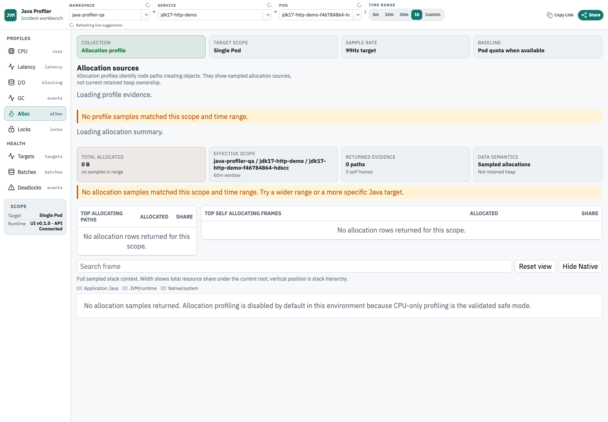

[](https://koolay.github.io/java-profiler/) [](https://koolay.github.io/java-profiler/zh/) [](https://github.com/koolay/java-profiler)



## Start here

1. Open [Quickstart](./getting-started/quickstart.md) and enable profiling with Kubernetes metadata.
2. Open the target service and check `status` to confirm that the JVM was accepted.
3. Start with `cpu` or `memory`, then move to `wall`, `io`, `gc`, `locks`, or `ingestion` as the incident requires.

## If you own a service

- [Quickstart](./getting-started/quickstart.md): enable profiling and read your first service profile.
- [Performance Analysis Manual](./operations/performance-analysis-user-manual.md): read CPU, Wall Clock, Java I/O wait, GC, allocation summary, lock, deadlock, target status, profile evidence guidance, and ingestion evidence.
- [Java Profiling Runbook](./operations/java-profiling-runbook.md): enable temporary or continuous profiling for a Kubernetes workload.

## If you run the platform

- [Deployment and Operations](./operations/deployment-operations-admin-manual.md): install, secure, operate, upgrade, and troubleshoot the profiler.
- [Real Profiling Acceptance](./operations/real-profiling-acceptance-standard.md): prove CPU, Wall Clock, Java I/O wait, GC, allocation, lock, ClickHouse, UI, and ingestion behavior before shipping changes.

## If you are contributing

- [Contributing](./contributing/development.md): run local checks, build docs, and execute real acceptance.
- [Architecture](./architecture/java-profiler-architecture.md): understand the collector, backend, ClickHouse store, contracts, and web UI.
- [E2E Automation Guide](./operations/e2e-automation-test-guide.md): run browser and real Kubernetes acceptance flows.
- [Profiling Contracts](./reference/profiling-contracts.md): inspect stable payload and configuration contracts.
- [GitHub Issues](https://github.com/koolay/java-profiler/issues): report bugs and request changes.

## Language and evidence

- Use the English / 简体中文 switch in the top bar to change languages.
- The screenshots on this page come from a real acceptance environment. The allocation screenshot shows the current Allocation Summary and flamegraph workflow; it is not mocked UI state.

## Local preview

Run these commands from the repository root:

```bash
cd docs
npm install
npm run docs:dev
```

Build the publishable static site:

```bash
cd docs
npm run docs:build
```
