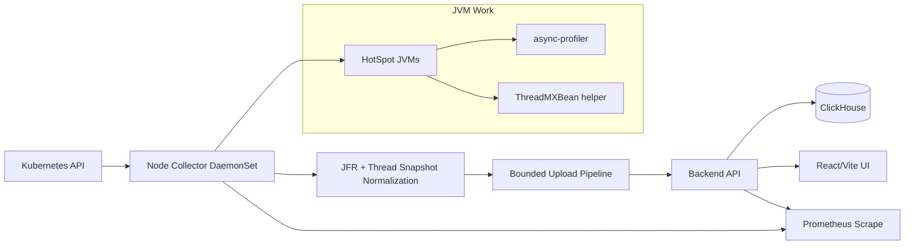
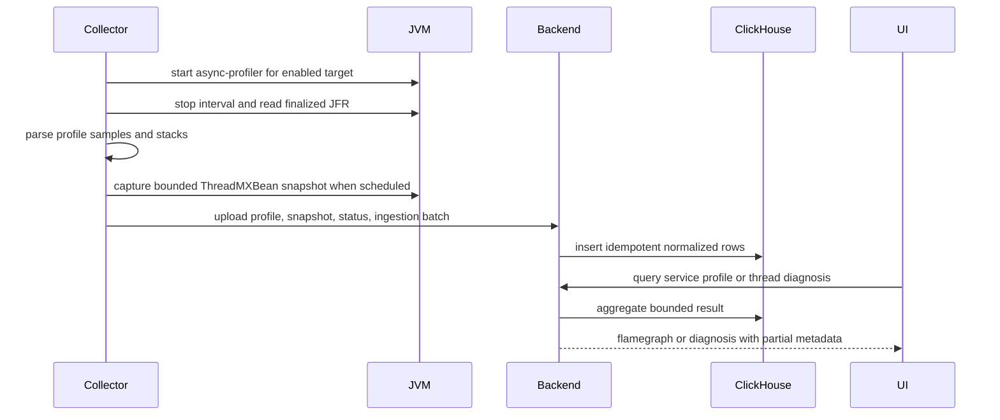

# feat: Build Java Profiler system

## Summary

Implement the Java-only Kubernetes profiling system as a vertical slice: shared contracts and ClickHouse schema first, then backend ingestion/query paths, a node-local Go collector with async-profiler and ThreadMXBean integration, a narrow React/Vite UI, and Kubernetes-installable artifacts.

---

## Problem Frame

The requirements define a production-safe Java performance diagnosis system for Kubernetes that is narrower than Coroot, Pyroscope, or a general observability platform. The implementation must let operators opt in to Java profiling without restarting workloads, store profile and thread-diagnosis data in existing single-node ClickHouse, and keep metrics exporter-only for the existing Prometheus stack.

---

## Requirements

- R1. Support opt-in profiling through Kubernetes annotations or labels. Covers origin R1-R6, R27-R29.
- R2. Run collection as a node-local DaemonSet that discovers and attaches to local HotSpot JVMs. Covers origin R7-R12.
- R3. Collect Java CPU, allocation bytes, allocation objects, lock contention count, and lock delay profiles through async-profiler. Covers origin R9.
- R4. Collect bounded thread snapshots and deadlock data through structured JVM management APIs. Covers origin R30-R36, R39-R40.
- R5. Store profile, stack, thread snapshot, deadlock, target status, ingestion, and optional artifact index data in ClickHouse with retention at or below 7 days. Covers origin R13-R20.
- R6. Expose operational metrics only through collector/backend exporters; do not store Prometheus-style metrics in ClickHouse or render metric dashboards. Covers origin R10, R19, R23, R43.
- R7. Provide a service-centric UI for profiles, thread diagnosis, deadlocks, target status, and ingestion health. Covers origin R21-R26, R30-R35.
- R8. Require authenticated collector uploads and scoped UI queries. Covers origin R37.
- R9. Make missing or partial data explainable through target status, ingestion status, dropped-batch metrics, and partial-result metadata. Covers origin R12, R29, R38.
- R10. Ship deployable collector, backend, UI, and Kubernetes installation artifacts. Covers origin R41-R42.

**Origin actors:** A1 Platform operator, A2 Java service owner, A3 Incident responder, A4 Profiling agent, A5 Profiling backend.

**Origin flows:** F1 whitelist continuous profiling, F2 temporary incident profiling, F3 profile investigation, F4 profiling shutdown, F5 thread diagnosis snapshot, F6 memory pressure investigation.

**Origin acceptance examples:** AE1-AE17 from `docs/brainstorms/java-profiler-requirements.md` are carried into implementation unit test scenarios where they affect behavior.

---

## Scope Boundaries

- Do not add Pyroscope, Parca, Grafana, or another profile backend as a runtime dependency.
- Do not build a general observability workspace, log viewer, tracing UI, service map, or non-Java profiler.
- Do not implement OpenJ9 support in v1.
- Do not require distributed ClickHouse in v1.
- Do not store Prometheus-style metric time series in ClickHouse.
- Do not render JVM/service metric dashboards in the product UI.
- Do not implement heap dump analysis, retained-heap dominator trees, object reference graphs, or leak-suspect analysis.
- Do not claim exact historical thread execution between snapshots.
- Do not retain collected data for more than 7 days.
- Do not make OpenTelemetry Collector the runtime collector framework.

### Deferred to Follow-Up Work

- Compare/diff flamegraph coloring beyond single-profile visualization: future UI iteration after v1 data path is stable.
- OpenJ9 or non-HotSpot support: separate compatibility track.
- Retained-heap or heap-dump analysis: separate product scope requiring new requirements.

---

## Context & Research

### Relevant Code and Patterns

- `docs/brainstorms/java-profiler-requirements.md` is the product source of truth.
- `docs/architecture/java-profiler-architecture.md` defines the implementation architecture, failure modes, ADRs, storage model, frontend selection, and metrics boundary.
- `docs/research/coroot-node-agent-java-agent.md` captures Coroot research, including the distinction between Coroot's TLS Java agent and its async-profiler path.
- `AGENTS.md` requires English-language international research sources by default and preserves the metrics exporter-only boundary.
- The repository is documentation-first; there is no existing production code, package layout, or test framework to extend.

### Institutional Learnings

- No `docs/solutions/` directory exists yet.
- Existing project guidance requires docs-first alignment before implementation and retention no longer than 7 days.

### External References

- Kubernetes DaemonSet official documentation: `https://kubernetes.io/docs/concepts/workloads/controllers/daemonset/`
- async-profiler official repository and README: `https://github.com/async-profiler/async-profiler`
- Oracle `ThreadMXBean` Java SE 17 API documentation: `https://docs.oracle.com/en/java/javase/17/docs/api/java.management/java/lang/management/ThreadMXBean.html`
- ClickHouse TTL lifecycle article from ClickHouse: `https://clickhouse.com/blog/using-ttl-to-manage-data-lifecycles-in-clickhouse`
- OpenTelemetry Collector official configuration documentation: `https://opentelemetry.io/docs/collector/configuration/`
- Coroot node-agent configuration documentation: `https://docs.coroot.com/configuration/coroot-node-agent/`
- Grafana JFR parser Go package metadata: `https://pkg.go.dev/github.com/grafana/jfr-parser`

---

## Key Technical Decisions

- Use Go 1.23 or newer for collector and backend implementation: Coroot node-agent and OpenTelemetry Collector both make Go a practical reference point for node-local collection, batching, retry, exporters, and Kubernetes clients.
- Use standard Go libraries first for backend HTTP: prefer `net/http` and `ServeMux`, add `go-chi/chi` only if route grouping or middleware composition becomes materially clearer.
- Use official or widely adopted Go infrastructure libraries: `github.com/ClickHouse/clickhouse-go/v2`, `k8s.io/client-go`, and `github.com/prometheus/client_golang`.
- Keep collector custom and lightweight: OpenTelemetry Collector informs receiver/processor/exporter boundaries, but v1 collects Java profiles and thread diagnostics rather than generic OTLP telemetry.
- Package the ThreadMXBean helper as a small Java module: this keeps structured JVM snapshot logic separate from native async-profiler control and avoids text thread-dump parsing as the primary source.
- Normalize async-profiler JFR output before upload or during collector batching: ClickHouse stores query-ready profile samples and stack rows, not a long-term raw JFR archive.
- Prefer `github.com/grafana/jfr-parser` for Go-side JFR parsing if license review and compatibility checks pass: this reuses the same parser family studied in Coroot's async-profiler path without adopting Grafana or Pyroscope as runtime backends.
- Use ClickHouse MergeTree-family tables with TTL and query budgets: single-node shared ClickHouse needs bounded retention, cardinality controls, rollups, and exporter-visible TTL lag.
- Build the UI as a small React + TypeScript + Vite SPA: the product is an internal diagnosis console, not an SEO app or general dashboard builder.
- Self-own the v1 flamegraph renderer: generic chart libraries do not fit stack-tree zoom/search/truncation semantics well enough for the profile viewer.
- Keep metrics exporter-only: collector/backend exporters feed the existing Prometheus stack; metrics are not part of ClickHouse profile storage or UI dashboard scope.
- Treat failure modes as first-class implementation work: status, partial-result metadata, dropped batches, duplicate batches, and retention health must be implemented before production rollout.

---

## Open Questions

### Resolved During Planning

- Collector runtime framework: implement a custom collector; reference Coroot for Java profiling mechanics and OpenTelemetry Collector only for internal pipeline boundaries.
- Metrics storage: metrics are exporter-only and owned by Prometheus-series services.
- Thread snapshot source: use a small ThreadMXBean helper rather than text thread dumps as the primary source.
- Frontend stack: use React + TypeScript + Vite and a self-owned flamegraph renderer.
- Raw artifacts: disabled by default; optional artifact index has a maximum 24-hour debug retention and no replay surface.

### Deferred to Implementation

- Exact annotation names and label keys: define during U1, then keep stable across collector, docs, and Helm chart.
- Exact ClickHouse DDL syntax and engine settings: define during U2 against the selected ClickHouse version and driver.
- Exact async-profiler version and asset layout: choose during U5 after packaging constraints are known.
- Exact ThreadMXBean helper packaging and attach invocation: finalize during U6 while testing against supported JDKs.
- Exact UI visual treatment: decide during U8 while preserving the architecture's narrow workflow and accessibility constraints.

---

## Output Structure

```text
cmd/
  backend/
  collector/
collector/
  internal/
    assets/
    attach/
    discovery/
    jfr/
    pipeline/
    policy/
    status/
    threads/
backend/
  internal/
    app/
    clickhouse/
    domain/
    httpapi/
    metrics/
contracts/
  profiling/
db/
  clickhouse/
java-helper/
  thread-diagnostics/
web/
  src/
    api/
    features/
    routes/
    visualization/
deploy/
  helm/
  manifests/
docs/
  plans/
```

This tree is directional. The implementing agent may adjust package boundaries if the final language/tooling setup calls for a better layout, but the responsibilities and test coverage in the units below remain the scope contract.

---

## High-Level Technical Design

> *This illustrates the intended approach and is directional guidance for review, not implementation specification. The implementing agent should treat it as context, not code to reproduce.*





---

## Implementation Units

### U1. Contracts, Configuration, and Repository Scaffolding

**Goal:** Establish the repo's implementation skeleton, shared data contracts, configuration vocabulary, and test harness conventions.

**Requirements:** R1, R2, R5, R6, R8, R9, R10; origin F1-F4; AE1, AE3.

**Dependencies:** None.

**Files:**
- Create: `go.mod`
- Create: `cmd/backend/main.go`
- Create: `cmd/collector/main.go`
- Create: `contracts/profiling/payloads.md`
- Create: `contracts/profiling/configuration.md`
- Create: `collector/internal/policy/policy.go`
- Create: `collector/internal/policy/policy_test.go`
- Create: `backend/internal/domain/types.go`
- Create: `backend/internal/domain/types_test.go`
- Modify: `README.md`
- Modify: `docs/index.md`

**Approach:**
- Pin Go 1.23 or newer in `go.mod`.
- Use `ghcr.io/koolay/library/golang:1.26.0` as the base image for the collector and backend Dockerfiles so the Go toolchain is pinned consistently across local builds and CI.
- Add only the baseline dependencies needed by the first implementation units: ClickHouse driver, Kubernetes client, Prometheus client, and JFR parser after license review.
- Define the canonical target identity, profile type catalog, enablement modes, batch metadata, status reasons, and retention constants.
- Make JVM start time part of the canonical target identity so restarted processes do not collide when PID values are reused.
- Define the Kubernetes annotation or label vocabulary once and reference it from collector policy, docs, and deployment artifacts.
- Keep configuration defaults aligned with requirements: profiling disabled by default, temporary profiling bounded, explicit disable wins, metrics exporter-only.
- Establish package boundaries for collector, backend, contracts, Java helper, UI, ClickHouse DDL, and deployment assets.
- Avoid generic `utils`, `helpers`, `common`, or `shared` packages; use bounded-context package names such as `policy`, `discovery`, `jfr`, `threads`, `clickhouse`, and `httpapi`.

**Execution note:** Start with contract and policy tests before adding collector/backend runtime behavior.

**Patterns to follow:**
- `docs/brainstorms/java-profiler-requirements.md`
- `docs/architecture/java-profiler-architecture.md`
- `AGENTS.md`

**Test scenarios:**
- Covers AE1. Happy path: workload without profiling metadata is evaluated -> target desired state is disabled.
- Covers AE3. Happy path: temporary profiling metadata with an expired duration is evaluated -> desired state is disabled.
- Contract scenario: a restarted JVM with the same PID but a different start time resolves to a distinct target identity.
- Edge case: explicit disable and continuous enablement are both present -> explicit disable wins.
- Edge case: temporary and continuous enablement are both present -> active temporary mode wins until expiry.
- Error path: invalid duration metadata is present -> target status includes a validation failure and no profiling is started.
- Contract scenario: every profile type from requirements has a stable enum, unit, and storage name.

**Verification:**
- Shared contracts name every v1 profile, target identity field, status reason, and batch type.
- Policy tests prove precedence and safe defaults before collector attach work begins.

---

### U2. ClickHouse Schema, Retention, and Storage Ports

**Goal:** Create ClickHouse schema and storage abstraction for profile samples, stacks, thread snapshots, deadlocks, target status, ingestion batches, retention status, and optional artifact indexes.

**Requirements:** R5, R6, R9; origin R13-R20, R38, R43; AE5, AE7, AE15.

**Dependencies:** U1.

**Files:**
- Create: `db/clickhouse/001_initial_profile_schema.sql`
- Create: `backend/internal/clickhouse/schema.go`
- Create: `backend/internal/clickhouse/profile_repository.go`
- Create: `backend/internal/clickhouse/thread_repository.go`
- Create: `backend/internal/clickhouse/status_repository.go`
- Create: `backend/internal/clickhouse/ingestion_repository.go`
- Create: `backend/internal/clickhouse/retention_repository.go`
- Create: `backend/internal/clickhouse/profile_repository_test.go`
- Create: `backend/internal/clickhouse/retention_repository_test.go`
- Modify: `contracts/profiling/payloads.md`

**Approach:**
- Use MergeTree-family tables with daily partitions, target/time/profile ordering, stable stack ids, and TTL at or below 7 days.
- Add `ingestion_batches` as the idempotency anchor for collector retries.
- Keep raw artifacts disabled by default and model only a short-lived optional index.
- Define repository ports in the backend domain and adapters in the ClickHouse layer.
- Export storage health through backend metrics rather than UI dashboards or ClickHouse time-series storage.

**Execution note:** Treat DDL and repository behavior as a characterization point: tests should make retention and idempotency explicit before ingestion code uses the tables.

**Patterns to follow:**
- Architecture sections `ClickHouse Storage Design`, `Partitioning and TTL Direction`, and `Failure Mode Matrix`.
- ClickHouse TTL lifecycle guidance from ClickHouse's official TTL article.

**Test scenarios:**
- Covers AE5. Happy path: profile sample rows and stack rows are inserted -> a later query can reconstruct stack values without the JVM.
- Covers AE7. Retention: every collected-data table has a TTL at or below 7 days; optional artifact index retention is 24 hours maximum when enabled.
- Covers AE15. Error path: duplicate ingestion batch id is accepted idempotently or rejected with a non-retryable status according to batch metadata.
- Edge case: profile stack with more than the configured frame limit is truncated or rejected according to contract metadata.
- Error path: ClickHouse insert timeout -> repository returns retryable storage failure without marking invalid data as accepted.
- Health scenario: retention repository reports oldest row, TTL lag, table size, and part count as exporter metric inputs.

**Verification:**
- DDL and repository tests prove retention, idempotency, and bounded cardinality assumptions.
- No Prometheus-style metric table is introduced.

---

### U3. Backend Ingestion, Auth, Exporter Metrics, and Status APIs

**Goal:** Implement authenticated backend ingestion for collector uploads and expose exporter metrics for ingestion, ClickHouse health, and query/storage status.

**Requirements:** R5, R6, R8, R9; origin R13-R20, R29, R37-R38, R43; AE5, AE7, AE14, AE15.

**Dependencies:** U1, U2.

**Files:**
- Create: `backend/internal/httpapi/server.go`
- Create: `backend/internal/httpapi/auth.go`
- Create: `backend/internal/httpapi/ingest_handlers.go`
- Create: `backend/internal/app/ingest_profile_batch.go`
- Modify: `backend/internal/app/ingest_thread_snapshot_batch.go`
- Create: `backend/internal/app/ingest_target_status_batch.go`
- Create: `backend/internal/app/ingest_collector_heartbeat.go`
- Create: `backend/internal/metrics/exporter.go`
- Create: `backend/internal/httpapi/ingest_handlers_test.go`
- Create: `backend/internal/app/ingest_profile_batch_test.go`
- Create: `backend/internal/metrics/exporter_test.go`
- Modify: `contracts/profiling/payloads.md`

**Approach:**
- Use `net/http` as the default HTTP server surface. Keep handlers thin and route all business behavior into `backend/internal/app`.
- Use explicit middleware for authentication, request size limits, and request timeouts.
- Implement scoped collector authentication before any upload endpoint accepts stack data.
- Issue collector credentials as short-lived Kubernetes secrets or projected service-account tokens, define rotation/expiry in chart values, and fail closed when credentials are missing or expired.
- Require TLS in transit for collector/backend and UI/backend traffic; prefer mTLS where certificate automation is available and document trust-root rotation.
- Validate payload shape and target identity before writing to ClickHouse.
- Use `ingestion_batches` to distinguish duplicate, malformed, retryable, and accepted uploads.
- Expose ingestion, duplicate, storage failure, ClickHouse latency, TTL lag, and table-size metrics through exporter endpoints.
- Keep health/status APIs product-shaped and bounded; do not expose raw ClickHouse rows.

**Execution note:** Add failing tests for unauthenticated upload and duplicate batch behavior before implementing handler internals.

**Patterns to follow:**
- Architecture sections `Backend Architecture`, `Exporter Metrics`, `Failure Handling`, and `Security and Permissions`.

**Test scenarios:**
- Covers AE14. Error path: unauthenticated collector upload -> backend rejects request and writes no stack data.
- Error path: missing or expired collector credentials -> backend rejects request before any stack data is accepted.
- Covers AE5. Happy path: valid profile batch upload -> profile rows, stack rows, target status, and ingestion batch status are persisted.
- Covers AE15. Error path: malformed non-retryable batch -> backend records rejected batch status and returns no retry instruction.
- Error path: retryable ClickHouse failure -> backend preserves idempotency and indicates the collector may retry.
- Edge case: duplicate accepted batch -> backend does not double-count samples.
- Metrics scenario: ingestion success, ingestion failure, duplicate, ClickHouse latency, and TTL lag are exposed as exporter metrics only.

**Verification:**
- Backend rejects unauthenticated upload and query paths by default.
- Backend enforces encrypted transport and credential expiry for ingest/query paths.
- Ingestion tests prove duplicate uploads cannot inflate stored profile values.

---

### U4. Collector Discovery, Enablement Policy, Status, and Bounded Upload Pipeline

**Goal:** Build the node-local collector foundation: Kubernetes metadata watching, local JVM discovery, HotSpot eligibility, policy evaluation, status reporting, metrics exporter, and bounded upload buffering without profiling yet.

**Requirements:** R1, R2, R6, R8, R9, R10; origin R1-R8, R11-R12, R27-R29, R38, R43; AE1, AE3, AE4, AE15.

**Dependencies:** U1, U3.

**Files:**
- Create: `collector/internal/discovery/pod_watcher.go`
- Create: `collector/internal/discovery/process_scanner.go`
- Create: `collector/internal/discovery/hotspot_detector.go`
- Create: `collector/internal/status/status_store.go`
- Create: `collector/internal/pipeline/upload_scheduler.go`
- Create: `collector/internal/pipeline/local_buffer.go`
- Create: `collector/internal/pipeline/backend_client.go`
- Create: `collector/internal/metrics/exporter.go`
- Create: `collector/internal/discovery/process_scanner_test.go`
- Create: `collector/internal/discovery/hotspot_detector_test.go`
- Create: `collector/internal/pipeline/local_buffer_test.go`
- Create: `collector/internal/pipeline/upload_scheduler_test.go`
- Modify: `cmd/collector/main.go`

**Approach:**
- Run as a DaemonSet-oriented process but keep K8s, process scanning, and upload dependencies behind adapters.
- Resolve targets from Pod metadata plus local process/container identity.
- Identify HotSpot-compatible JVMs and report unsupported JVMs as skipped rather than failed.
- Detect pre-existing async-profiler library mappings before profiling work begins.
- Implement bounded buffering by bytes, batch count, and oldest age; drop oldest data when full and expose drop metrics.
- Add jitter to upload schedules to avoid cluster-wide synchronized writes.

**Execution note:** Characterize local buffering and policy before integrating real JVM attach.

**Patterns to follow:**
- Architecture `Collector Architecture`, `Collector Reference Strategy`, and `Failure Mode Matrix`.
- Kubernetes DaemonSet official model for node-local facilities.
- Coroot node-agent research for node-local Java profiling mechanics.

**Test scenarios:**
- Covers AE1. Happy path: Java Pod without enablement metadata -> collector reports disabled and does not attempt attach.
- Covers AE3. Happy path: temporary window expires -> collector reports stopped status.
- Covers AE4. Happy path: process maps indicate async-profiler conflict -> collector reports conflict and skips attach.
- Covers AE15. Error path: backend unavailable and local buffer overflows -> oldest batches are dropped and dropped-batch metrics include oldest dropped timestamp.
- Edge case: process exits during target resolution -> collector marks unknown or skipped and does not attach.
- Error path: stale Pod/container mapping -> target status records discovery failure and no profiling attempt occurs.
- Metrics scenario: discovered, eligible, active, skipped, failed, uploaded, retried, and dropped counters are exporter-only.

**Verification:**
- Collector can run discovery and status reporting without starting any profiler.
- Missing data is explainable through target status and exporter metrics.

---

### U5. Async-Profiler Asset Management, Attach Lifecycle, JFR Parsing, and Profile Upload

**Goal:** Add async-profiler deployment/control and JFR parsing for CPU, allocation, and lock profile uploads.

**Requirements:** R2, R3, R5, R6, R9; origin R7-R12, R13-R16, R27-R29, R38; AE2, AE4, AE5, AE6, AE8, AE15.

**Dependencies:** U1, U3, U4.

**Files:**
- Create: `collector/internal/assets/async_profiler.go`
- Create: `collector/internal/attach/jvm_attach.go`
- Create: `collector/internal/jfr/parser.go`
- Create: `collector/internal/jfr/normalizer.go`
- Create: `collector/internal/pipeline/profile_batcher.go`
- Create: `collector/internal/assets/async_profiler_test.go`
- Create: `collector/internal/attach/jvm_attach_test.go`
- Create: `collector/internal/jfr/parser_test.go`
- Create: `collector/internal/jfr/normalizer_test.go`
- Modify: `collector/internal/status/status_store.go`
- Modify: `contracts/profiling/payloads.md`

**Approach:**
- Package async-profiler assets for supported Linux architectures and stage them through an init-container-populated writable volume or equivalent ephemeral mount instead of assuming the target root filesystem is writable.
- Attach to HotSpot JVMs, start a bounded async-profiler session, stop intervals to finalize JFR, parse JFR, upload normalized samples, and restart with minimal gap.
- Parse or transform async-profiler JFR events into the five profile types required by the contract.
- Prefer `github.com/grafana/jfr-parser` as the initial parser dependency after license review; keep parser usage behind `collector/internal/jfr` so it can be replaced if compatibility fails.
- Verify async-profiler and helper artifacts by pinned digest or checksum during build and fail the pipeline if the provenance check does not match.
- Preserve target status when attach, start, stop, finalization, parse, or upload fails.
- Delete raw JFR artifacts after parsing unless debug artifact capture is explicitly enabled.

**Execution note:** Add fixture-based parser tests before wiring parsed samples into upload batches.

**Patterns to follow:**
- Coroot async-profiler research in `docs/research/coroot-node-agent-java-agent.md`.
- async-profiler official support for CPU, allocation, and contended lock profiling.

**Test scenarios:**
- Covers AE2. Happy path: enabled HotSpot JVM after startup delay -> collector starts CPU/allocation/lock profiling and uploads normalized samples.
- Covers AE4. Error path: async-profiler conflict detected before start -> collector skips and reports conflict.
- Covers AE5. Happy path: parsed profile upload -> backend can later render flamegraph without JVM access.
- Covers AE6 and AE8. Happy path: allocation profile samples for selected Pod/time range -> allocation flamegraph data exists for UI drilldown.
- Deployment path: async-profiler assets are staged through a writable mount on a read-only target filesystem and attach still succeeds when the security context allows it.
- Error path: JVM exits during attach -> target status records attach failure and retry uses backoff.
- Error path: stop succeeds but JFR file is incomplete or parser rejects it -> interval is marked failed, artifact is discarded, target remains eligible.
- Edge case: one profile type has no samples in an interval -> available profile types still upload and missing type is represented as unavailable, not as total target failure.

**Verification:**
- Profile upload includes stable target identity, profile type, stack id, sample value, and interval metadata.
- Async-profiler failures do not break collector discovery or exporter metrics.

---

### U6. ThreadMXBean Helper, Thread Snapshots, Deadlocks, and Busy/Slow Thread Summaries

**Goal:** Implement structured JVM thread diagnostics using a small attached Java helper and backend normalization for deadlocks, slow threads, and busy thread evidence.

**Requirements:** R4, R7, R9; origin R30-R36, R39-R40; AE9, AE10, AE11, AE12, AE13, AE16.

**Dependencies:** U1, U3, U4.

**Files:**
- Create: `java-helper/thread-diagnostics/pom.xml`
- Create: `java-helper/thread-diagnostics/src/main/java/com/ebpfjava/threads/ThreadDiagnosticsAgent.java`
- Create: `java-helper/thread-diagnostics/src/main/java/com/ebpfjava/threads/ThreadSnapshotCommand.java`
- Create: `java-helper/thread-diagnostics/src/main/java/com/ebpfjava/threads/ThreadSnapshotPayload.java`
- Create: `java-helper/thread-diagnostics/src/test/java/com/ebpfjava/threads/ThreadSnapshotCommandTest.java`
- Create: `java-helper/thread-diagnostics/src/test/java/com/ebpfjava/threads/ThreadSnapshotPayloadTest.java`
- Create: `collector/internal/threads/helper_asset.go`
- Create: `collector/internal/threads/snapshot_collector.go`
- Create: `collector/internal/threads/snapshot_normalizer.go`
- Create: `collector/internal/threads/snapshot_collector_test.go`
- Create: `collector/internal/threads/snapshot_normalizer_test.go`
- Create: `backend/internal/app/ingest_thread_snapshot_batch.go`
- Create: `backend/internal/domain/thread_analysis.go`
- Create: `backend/internal/domain/thread_analysis_test.go`
- Modify: `contracts/profiling/payloads.md`

**Approach:**
- Build a minimal Java helper that uses `ThreadMXBean` for thread info, lock ownership, deadlock detection, and per-thread CPU data when available.
- Package the Java helper as a verified artifact and stage it through the same mounted asset path model used for async-profiler.
- Keep contention monitoring disabled by default; allow it only in temporary profiling windows when explicitly configured.
- Bound snapshot depth, frequency, duration, payload size, and helper runtime.
- Model confidence explicitly: exact thread CPU, sampled RUNNABLE evidence, or profile-only hotspot.
- Ensure thread snapshot failure does not stop async-profiler profile collection.

**Execution note:** Add domain tests for deadlock and confidence classification before connecting helper output to UI query APIs.

**Patterns to follow:**
- Oracle `ThreadMXBean` documentation for CPU time support, contention monitoring support, stack/lock info, and deadlock detection.
- Architecture `Thread Snapshot`, `Busy Thread Summary`, and `Degraded Operation Rules`.

**Test scenarios:**
- Covers AE9. Happy path: helper reports a deadlock cycle -> backend stores deadlock event with involved threads, locks, and blocking stacks.
- Covers AE10. Happy path: repeated BLOCKED snapshots on same monitor -> slow-thread summary identifies blocked threads and blocking stack evidence.
- Covers AE11. Happy path: thread CPU deltas are available -> busy-thread summary ranks threads with exact CPU confidence.
- Covers AE12. Unsupported question: only allocation profiles exist for memory issue -> API/UI metadata can explain retained heap is not answered.
- Covers AE13. Temporary profiling with high-frequency snapshots expires -> helper snapshot schedule stops automatically.
- Covers AE16. Edge case: per-thread CPU time unavailable -> busy-thread result is labeled sampled or profile-only and does not claim exact ownership.
- Error path: helper attach succeeds but ThreadMXBean call times out -> snapshot path is skipped while async-profiler continues.

**Verification:**
- Thread diagnostics can answer deadlock, slow thread, and busy thread questions with explicit confidence.
- Snapshot overhead controls are testable and visible in status/metrics.

---

### U7. Query APIs, Flamegraph Aggregation, Partial Results, and Authorization

**Goal:** Implement product-shaped backend query APIs for service summaries, flamegraphs, top stacks, target status, ingestion status, retention status, deadlocks, and thread diagnosis.

**Requirements:** R5, R7, R8, R9; origin R16, R21-R26, R29-R35, R37-R38; AE5, AE6, AE8-AE12, AE14-AE16.

**Dependencies:** U2, U3, U5, U6.

**Files:**
- Create: `backend/internal/app/query_service_summary.go`
- Create: `backend/internal/app/query_flamegraph.go`
- Create: `backend/internal/app/query_top_stacks.go`
- Create: `backend/internal/app/query_thread_diagnosis.go`
- Create: `backend/internal/app/query_deadlock_details.go`
- Create: `backend/internal/app/query_status.go`
- Create: `backend/internal/domain/flamegraph_builder.go`
- Create: `backend/internal/domain/flamegraph_builder_test.go`
- Create: `backend/internal/httpapi/query_handlers.go`
- Create: `backend/internal/httpapi/query_handlers_test.go`
- Modify: `backend/internal/httpapi/auth.go`
- Modify: `contracts/profiling/payloads.md`

**Approach:**
- Return product-shaped response models, not raw ClickHouse rows.
- Build flamegraph trees from stack rollups or bounded raw scans.
- Include machine-readable metadata for timeout, scan limit, stack limit, node limit, rollup lag, missing data source, and truncation.
- Enforce namespace/service authorization before returning stack traces.
- Require TLS in transit for all query endpoints and reuse the same certificate trust model as ingestion.
- Keep Prometheus dashboard integration as optional links or context only; do not render or query metrics dashboards from this API.

**Execution note:** Start with failing tests for unauthorized query and partial-result metadata.

**Patterns to follow:**
- Architecture `Profile Query`, `Query API Shape`, `Query Budgets`, and `Failure Mode Matrix`.

**Test scenarios:**
- Covers AE5. Happy path: completed profile upload is queried for same service/time range -> API returns flamegraph tree.
- Covers AE6. Happy path: selected Pod/time range with allocation samples -> API returns allocation flamegraph/top allocators for that Pod.
- Covers AE8. Happy path: memory view query for allocation bytes -> API returns allocating stacks without presenting retained-heap claims.
- Covers AE9. Happy path: deadlock event exists -> API returns cycle details with involved threads and locks.
- Covers AE10. Happy path: blocked thread snapshots exist -> API returns slow-thread summary and related lock profile evidence when available.
- Covers AE11. Happy path: busy thread evidence exists -> API returns busy-thread summary and matching CPU stack evidence when available.
- Covers AE14. Error path: unauthorized namespace query -> API returns no stack data.
- Covers AE16. Edge case: exact CPU evidence unavailable -> API labels confidence as sampled or profile-only.
- Error path: flamegraph query exceeds budget -> API returns partial response with explicit reason and bounded tree.

**Verification:**
- Every query accepts explicit limits and can return a bounded partial response.
- UI clients can distinguish disabled, unsupported, missing, failed, timed out, partial, and retention-expired states.

---

### U8. Service-Centric React UI and Self-Owned Flamegraph Renderer

**Goal:** Build the narrow UI for service status, memory allocation profiles, CPU/busy threads, locks/slow threads, deadlocks, target status, ingestion health, and optional links to existing Prometheus dashboards.

**Requirements:** R6, R7, R8, R9; origin R21-R26, R30-R35, R37; AE5-AE12, AE14-AE16.

**Dependencies:** U7.

**Files:**
- Create: `web/package.json`
- Create: `web/vite.config.ts`
- Create: `web/src/main.tsx`
- Create: `web/src/api/client.ts`
- Create: `web/src/api/types.ts`
- Create: `web/src/routes/service-overview.tsx`
- Create: `web/src/features/memory/memory-view.tsx`
- Create: `web/src/features/cpu/cpu-view.tsx`
- Create: `web/src/features/locks/locks-view.tsx`
- Create: `web/src/features/deadlocks/deadlocks-view.tsx`
- Create: `web/src/features/status/target-status-view.tsx`
- Create: `web/src/features/ingestion/ingestion-health-view.tsx`
- Create: `web/src/visualization/flamegraph.tsx`
- Create: `web/src/visualization/flamegraph.test.tsx`
- Create: `web/src/features/status/target-status-view.test.tsx`
- Create: `web/src/features/deadlocks/deadlocks-view.test.tsx`
- Create: `web/tests/profiling-flow.spec.ts`
- Modify: `README.md`

**Approach:**
- Use React + TypeScript + Vite with URL search params as the source of truth for namespace, service, Pod, container, JVM, profile type, and time range.
- Use backend API responses as typed server state and keep local UI state minimal.
- Build a self-owned SVG or Canvas flamegraph renderer over backend-provided tree JSON.
- Define the flamegraph interaction contract for v1: search, zoom, reset, stack selection, top-table drilldown, and partial-result warning behavior.
- Define responsive and accessibility behavior for the UI: narrow-screen layout changes, keyboard navigation, focus management, and minimum screen-reader labels for tables and flamegraphs.
- Display partial/truncated result warnings prominently and preserve machine-readable reason details for support.
- Show unsupported-question copy for retained heap and historical execution gaps.
- Provide optional external Prometheus dashboard links using configured templates; do not render metric charts.

**Execution note:** Implement UI states with component tests before polishing visual treatment.

**Patterns to follow:**
- Architecture `Web UI Architecture`, `Frontend Technology Selection`, `Metrics Dashboard Decision`, and `Flamegraph Decision`.

**Test scenarios:**
- Covers AE5. Happy path: user opens profile view after upload -> flamegraph renders from backend tree data.
- Covers AE6. Happy path: user filters to a Pod/time range -> allocation flamegraph and top allocator table reflect selected target.
- Covers AE8. Happy path: memory view displays allocation sources and Prometheus-link context without heap/GC charts.
- Covers AE9. Happy path: deadlock event is returned -> UI shows cycle, involved locks, threads, and stack frames.
- Covers AE10. Happy path: slow-thread data is returned -> UI shows blocked/waiting threads and lock evidence.
- Covers AE11. Happy path: busy-thread data is returned -> UI labels exact, sampled, or profile-only confidence.
- Covers AE12. Unsupported question: retained heap is requested or implied -> UI explains allocation profiles are not retained-heap ownership.
- Covers AE14. Error path: unauthorized response -> UI shows unauthorized state and no stack trace.
- Edge case: flamegraph is truncated -> UI shows omitted-node warning and does not imply complete evidence.
- Error path: backend returns query timeout partial result -> UI renders bounded result with explicit warning.
- Accessibility scenario: keyboard-only navigation can search and drill into a flamegraph on the narrow layout without losing focus.

**Verification:**
- UI stays service-centric and does not become a general observability dashboard.
- Core flows are covered by component tests and at least one browser flow.

---

### U9. Packaging, Kubernetes Deployment, CI, and Operational Documentation

**Goal:** Make the system installable in Kubernetes with collector/backend/UI images, Helm or manifest deployment, exporter metrics, security configuration, and release documentation.

**Requirements:** R1, R2, R6, R8, R9, R10; origin R1-R7, R27-R29, R37-R43; AE1-AE3, AE13-AE17.

**Dependencies:** U1-U8.

**Files:**
- Create: `Dockerfile.collector`
- Create: `Dockerfile.backend`
- Create: `Dockerfile.web`
- Create: `deploy/helm/Chart.yaml`
- Create: `deploy/helm/values.yaml`
- Create: `deploy/helm/templates/collector-daemonset.yaml`
- Create: `deploy/helm/templates/backend-deployment.yaml`
- Create: `deploy/helm/templates/web-deployment.yaml`
- Create: `deploy/helm/templates/rbac.yaml`
- Create: `deploy/helm/templates/service.yaml`
- Create: `deploy/manifests/README.md`
- Create: `.github/workflows/ci.yml`
- Create: `docs/operations/java-profiling-runbook.md`
- Create: `deploy/helm/values_test.yaml`
- Modify: `docs/index.md`
- Modify: `README.md`

**Approach:**
- Package collector, backend, UI, async-profiler assets, and Java helper artifacts into deployable images.
- Define minimum RBAC and security context needed for node-local process visibility and JVM attach.
- Pin async-profiler and Java-helper image contents by digest, verify checksums in CI, and document the source of truth for each executable artifact.
- Carry the same credential and certificate provisioning needed for TLS-enabled collector/backend and UI/backend traffic into the deployment chart and manifests.
- Stage runtime assets using the writable-volume model established in U5 so hardened pods and read-only root filesystems remain supported.
- Keep profiling opt-in by default in chart values.
- Expose collector/backend metrics endpoints for Prometheus scraping.
- Add CI validation for Go tests, Java helper tests, UI tests, DDL lint/validation, and Helm/template checks.
- Document enable, temporary enable, disable, failure interpretation, retention, and uninstall behavior.

**Execution note:** Treat install artifacts as part of v1 completeness, not a post-implementation task.

**Patterns to follow:**
- Kubernetes DaemonSet official guidance for node-local facilities and rolling updates.
- Architecture `Security and Permissions`, `Operational Model`, and `ADR-007`.

**Test scenarios:**
- Covers AE1. Happy path: default chart values install collector with profiling disabled.
- Covers AE2. Integration: enabled annotation in a test manifest allows collector to target HotSpot JVMs after startup delay.
- Covers AE3 and AE13. Integration: temporary enablement expires and the collector stops profiling and high-frequency snapshots.
- Covers AE14. Error path: backend upload/query without credentials is rejected in deployed configuration.
- Covers AE15. Error path: backend outage with collector buffer overflow exposes dropped-batch metrics.
- Covers AE17. Delivery: collector, backend, UI images and Kubernetes install artifacts exist and are referenced by docs.
- Security scenario: deployed manifests include the TLS credential material and artifact digests required by the runtime policy.
- Security scenario: CI fails if async-profiler or Java-helper digests/checksums do not match the pinned source of truth.
- Security scenario: RBAC grants only the permissions needed for Pod metadata and node-local collection behavior.

**Verification:**
- A platform operator can install the system, enable a Java workload, observe exporter metrics in Prometheus, and open the UI for profile/thread diagnosis.
- Release artifacts include dependency notices and avoid AGPL/source-available runtime dependencies.

---

## System-Wide Impact

- **Interaction graph:** Kubernetes metadata drives collector policy; collector attaches to local JVMs; collector uploads normalized batches; backend persists ClickHouse rows; UI queries backend; Prometheus scrapes collector/backend exporters.
- **Error propagation:** collector attach/parse/upload failures become target status, ingestion status, and exporter metrics; backend query failures become partial-result metadata; UI renders explicit state rather than silently showing empty data.
- **State lifecycle risks:** batch retries can duplicate data unless ingestion idempotency is implemented first; process ids can be reused unless JVM start time is part of identity; TTL lag can make retention appear broken unless exported.
- **API surface parity:** collector upload contracts, backend query contracts, UI API types, and documentation must share the same target identity, profile type, status reason, and confidence model.
- **Integration coverage:** end-to-end behavior requires tests across collector policy, backend ingestion, ClickHouse repositories, query APIs, and UI partial states; unit tests alone will not prove profile-to-flamegraph flow.
- **Unchanged invariants:** metrics remain exporter-only; ClickHouse stores profile and diagnosis data only; Prometheus owns metric storage, dashboards, alerting, and retention.

---

## Risks & Dependencies

| Risk | Mitigation |
|------|------------|
| Kubernetes security policy blocks JVM attach | Keep target status explicit, document required permissions, and ship a minimal RBAC/security context baseline. |
| async-profiler behaves differently across JDK versions | Start with HotSpot-compatible JVMs, report unsupported states, and test representative OpenJDK/Corretto images. |
| ThreadMXBean CPU or contention data is unavailable or expensive | Detect capabilities, keep contention monitoring off by default, and label confidence clearly. |
| JFR parsing fails on incomplete or incompatible files | Treat parser failures as interval failures, discard bad artifacts, and keep target eligible. |
| ClickHouse storage grows too quickly | Enforce TTL, stack/frame limits, sample scan limits, rollups, and exporter-visible part/TTL metrics. |
| Query latency exceeds UI budget | Use rollups, query limits, timeouts, partial responses, and bounded flamegraph node counts. |
| Browser cannot render large flamegraphs | Truncate server responses, expose omitted-node metadata, and render incrementally or with virtualization. |
| Collector upload spikes overload backend/ClickHouse | Add jitter, bounded buffers, batch limits, retry backoff, and drop metrics. |
| Stack traces expose sensitive code structure | Require authenticated uploads and scoped UI queries; treat stack data as sensitive. |
| Plan scope expands into observability platform | Preserve explicit scope boundaries and defer logs, traces, service maps, metrics dashboards, and non-Java profiling. |

---

## Documentation / Operational Notes

- Update `README.md` as implementation directories become real.
- Keep `docs/index.md` current when adding runbooks, API contracts, or deployment docs.
- Add `docs/operations/java-profiling-runbook.md` with enablement examples, temporary profiling examples, disable behavior, failure status meanings, retention behavior, and Prometheus metric names.
- Document that Prometheus dashboards remain the source for JVM/service metric trends; the product UI provides profile/thread diagnosis and optional contextual links only.
- Include dependency license notices for Go, Java, and frontend runtime dependencies.

---

## Alternative Approaches Considered

- Use Pyroscope or Parca as profile backend: rejected because the user explicitly requires self-owned storage and no heavy/incompatible profile backend.
- Build on OpenTelemetry Collector as runtime framework: rejected because v1 needs Java profile/thread diagnostics and node-local attach behavior, not generic OTLP pipeline handling.
- Store raw JFR as primary data: rejected because ClickHouse should store query-ready normalized data, while raw artifacts are optional short-lived debug data.
- Render metrics dashboards in this UI: rejected because Prometheus-series services already own metric storage and dashboards.
- Use text thread dumps as primary thread data: rejected because ThreadMXBean provides structured stack, lock, deadlock, and CPU evidence.

---

## Success Metrics

- A Java service owner can enable profiling with Kubernetes metadata and get profile data without restarting the application.
- An incident responder can temporarily profile a Pod or service and have profiling stop automatically.
- A user can move from an existing Prometheus-observed symptom to a Java allocation, CPU, or lock flamegraph.
- A user can identify Java deadlock cycles, blocked threads, busy threads, and confidence level from thread diagnosis views.
- No collected data type remains beyond 7 days under default retention.
- Missing data states are explainable through target status, ingestion status, exporter metrics, and UI copy.
- The installed system exposes operational metrics through Prometheus-compatible endpoints only.

---

## Phased Delivery

### Phase 1: Storage and Ingestion Spine

- U1 contracts/scaffolding
- U2 ClickHouse schema/repositories
- U3 backend ingestion/auth/exporter metrics

### Phase 2: Collector Profile Collection

- U4 discovery/status/upload pipeline
- U5 async-profiler/JFR profile upload

### Phase 3: Thread Diagnosis and Querying

- U6 ThreadMXBean helper and thread summaries
- U7 query APIs and partial-result semantics

### Phase 4: Product Surface and Shipping

- U8 service-centric UI
- U9 packaging, CI, deployment, runbook

---

## Sources & References

- Origin document: `docs/brainstorms/java-profiler-requirements.md`
- Architecture document: `docs/architecture/java-profiler-architecture.md`
- Coroot research: `docs/research/coroot-node-agent-java-agent.md`
- Repository guidance: `AGENTS.md`
- Kubernetes DaemonSet documentation: https://kubernetes.io/docs/concepts/workloads/controllers/daemonset/
- async-profiler repository: https://github.com/async-profiler/async-profiler
- Oracle ThreadMXBean API: https://docs.oracle.com/en/java/javase/17/docs/api/java.management/java/lang/management/ThreadMXBean.html
- ClickHouse TTL lifecycle article: https://clickhouse.com/blog/using-ttl-to-manage-data-lifecycles-in-clickhouse
- OpenTelemetry Collector configuration documentation: https://opentelemetry.io/docs/collector/configuration/
- Coroot node-agent configuration documentation: https://docs.coroot.com/configuration/coroot-node-agent/
- Grafana JFR parser package metadata: https://pkg.go.dev/github.com/grafana/jfr-parser
