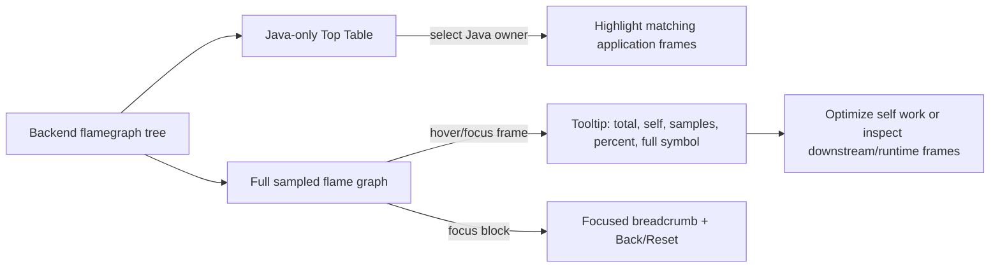

# fix: Close Pyroscope Analysis UX Gaps

## Summary

Improve the CPU profile screen from a working flame graph display into a practical bottleneck-analysis workflow. The plan keeps the self-owned UI and backend unchanged, but adds Pyroscope-inspired analysis affordances: tooltip metrics, stronger Top Table + Flame Graph coupling, application-frame emphasis, and clearer focus navigation.

---

## Problem Frame

The latest CPU view has real profile data, a Java-only Top Table, and a flame graph, but a user in `Flame Graph` mode can still be led toward native/runtime frames such as `so.6` instead of the Java owner they can act on. Real incident analysis needs immediate `Self` versus `Total` interpretation and a visible path from hot Java symbol to sampled stack context.

---

## Requirements

- R1. Preserve the service-centric Java analysis scope from the product requirements: the UI should help users connect a production symptom to the responsible Java method stack (see origin: `docs/brainstorms/java-profiler-requirements.md`, F3, R21, R23, R24, R25, AE5).
- R2. Keep the Top Table as the primary actionable Java owner list; native/runtime/JDK frames stay out of Hot Code by default but remain visible in the flame graph for context.
- R3. Make `Self CPU`, `Total CPU`, sample count, and percentage available at the point of interaction, not only in a below-the-fold detail panel.
- R4. Default and tested CPU analysis should keep Top Table and Flame Graph visible together so users can move between ranking and stack context without losing orientation.
- R5. Search, selected Java highlighting, hover inspection, and focus must preserve flame graph context unless the user explicitly focuses a block.
- R6. Do not reintroduce bundled source-code lookup; source viewing remains a future integration requiring build metadata and repository mapping.

**Origin actors:** A2 Java service owner, A3 incident responder, A5 profiling backend.
**Origin flows:** F3 Profile investigation.
**Origin acceptance examples:** AE5 Profile upload renders a flamegraph without re-attaching to the JVM.

---

## Scope Boundaries

- No backend, collector, ClickHouse schema, ingestion, or async-profiler changes.
- No Pyroscope, Grafana, Parca, or other profile backend dependency.
- No source-code viewer, demo-source lookup, or line-by-line source integration.
- No full sandwich view in this iteration.
- No memory or lock redesign in this iteration, except avoiding CPU-specific wording regressions in shared components.

### Deferred to Follow-Up Work

- Aggregated caller/callee or sandwich-style view for a selected Java symbol.
- Optional `Application only` / `Runtime included` flame graph display mode.
- Memory and lock profile-specific tooltip vocabulary beyond shared renderer support.

---

## Context & Research

### Relevant Code and Patterns

- `web/src/features/cpu/hot-code-view.tsx` owns Java frame aggregation, Top Table sorting, selected Java symbol state, and CPU insight copy.
- `web/src/visualization/flamegraph.tsx` owns flame graph layout, search, selection, focus, frame category classification, and selected-frame detail state.
- `web/src/styles.css` defines the current diagnostic UI visual language: calm utilitarian panels, monospace frame labels, visible focus outlines, and low-chrome borders.
- `web/src/features/cpu/hot-code-view.test.tsx`, `web/src/visualization/flamegraph.test.tsx`, and `web/tests/real-acceptance.spec.ts` already cover Top Table, flame graph selection, search, focus, and real Kubernetes UI behavior.

### Institutional Learnings

- `docs/research/pyroscope-profile-ui-study.md` is the active study document for this UI surface. It records that flame graph width is total share under the current root, vertical position is stack hierarchy, search should highlight/dim instead of replacing the graph, and source-code lookup should not be demo-only.
- `docs/plans/2026-05-10-005-pyroscope-study-alignment-polish.md` completed the previous polish pass: CPU-specific table labels, action-oriented insight copy, frame category legend, and focus status.

### External References

- Grafana Pyroscope flamegraph documentation: https://grafana.com/docs/pyroscope/latest/introduction/flamegraphs/
- Grafana Pyroscope Self vs Total documentation: https://grafana.com/docs/pyroscope/latest/view-and-analyze-profile-data/self-vs-total/
- Grafana Pyroscope profiling types documentation: https://grafana.com/docs/pyroscope/latest/introduction/profiling-types/
- Grafana Pyroscope UI reference repository: https://github.com/grafana/pyroscope

---

## Key Technical Decisions

- Default CPU analysis should prefer `Both` as the verified workflow. `Top Table` and `Flame Graph` modes can remain, but acceptance should prove the combined ranking + context path because that is the realistic bottleneck workflow.
- Add a first-class custom flame graph tooltip rather than relying on browser `title` or only the detail panel. Pyroscope's immediate hover explanation is the main missing analysis layer.
- Treat category color as orientation, not severity. Application Java should be visually easiest to act on, native/system should be quieter, and selected/highlighted Java frames should be more legible than generic search matches.
- Keep table selection as highlight, not search. Search remains user-entered dimming/highlighting; table selection should not mutate the search box or remove stack context.
- Preserve self-owned rendering. Any Pyroscope influence should remain interaction and information-design guidance, not a dependency import.

---

## Open Questions

### Resolved During Planning

- Should the next iteration add source context? No. The research document explicitly says source viewing requires repository metadata and should not be demo-only.
- Should runtime/native frames be hidden from the flame graph? No. They explain sampled execution context, but the visual hierarchy should make application Java the actionable owner.
- Should `Flame Graph` mode be removed? No. Keep it for focused graph inspection, but make the real acceptance path use `Both`.

### Deferred to Implementation

- Exact tooltip placement and collision handling: finalize while testing real browser screenshots because viewport, scroll container, and long frame names affect placement.
- Exact color values and opacity: tune against the live screenshot so native/system frames are readable but no longer visually dominate application Java.
- Whether keyboard focus should show the same tooltip as hover: decide during implementation based on accessibility test behavior and available component state.

---

## High-Level Technical Design

> *This illustrates the intended approach and is directional guidance for review, not implementation specification. The implementing agent should treat it as context, not code to reproduce.*

---

## Implementation Units

### U1. Add Flame Graph Tooltip Metrics

**Goal:** Give users Pyroscope-style immediate inspection when hovering or focusing a frame.

**Requirements:** R1, R3, R5

**Dependencies:** None

**Files:**
- Modify: `web/src/visualization/flamegraph.tsx`
- Modify: `web/src/styles.css`
- Test: `web/src/visualization/flamegraph.test.tsx`

**Approach:**
- Extend the flame graph layout data with enough derived metrics for UI inspection: current-root total share, sample count, and a self estimate derived from child totals.
- Replace reliance on browser `title` with an in-app tooltip or hover detail that shows full symbol, category, samples, total share, and self share.
- Ensure the same information is reachable through selection/focus for users who cannot hover.
- Keep tooltip content profile-neutral where possible, but label CPU-specific values as CPU when called from the CPU view if the component receives that context.

**Patterns to follow:**
- Existing `selectedFrame`, `selectedPercent`, and `flamegraph-detail` patterns in `web/src/visualization/flamegraph.tsx`.
- Existing accessible focus outline and compact diagnostic typography in `web/src/styles.css`.

**Test scenarios:**
- Happy path: hover or select an application Java frame with children -> tooltip/detail shows full frame name, samples, total share, and self share.
- Happy path: hover or select a native frame -> tooltip/detail shows full native symbol and category without presenting it as a Java optimization target.
- Edge case: frame with no children -> self equals total and the displayed percentages are consistent.
- Edge case: very narrow frame -> tooltip remains available even when inline text is hidden.
- Accessibility: keyboard focus or click exposes the same essential metrics that hover exposes.

**Verification:**
- Flame graph inspection no longer depends on browser-native title behavior.
- Tooltip/detail metrics match the selected frame's current root context.

---

### U2. Make Both Mode the Primary Analysis Path

**Goal:** Keep Java ranking and stack context visible together during default and real acceptance analysis.

**Requirements:** R1, R2, R4, R5

**Dependencies:** U1 can land independently; this unit should preserve compatibility with its tooltip state.

**Files:**
- Modify: `web/src/features/cpu/hot-code-view.tsx`
- Modify: `web/src/features/cpu/hot-code-view.test.tsx`
- Modify: `web/tests/real-acceptance.spec.ts`

**Approach:**
- Keep `Both` as the initial CPU view and make the acceptance path explicitly exercise `Both` for real performance diagnosis.
- Reframe `Flame Graph` mode as an optional inspection mode, not the primary tested workflow.
- Ensure selecting a Top Table row highlights matching application frames without changing the search input and without dimming unrelated context.
- Keep `Self CPU` and `Total CPU` visible in `Both` at desktop widths used by acceptance tests.

**Patterns to follow:**
- Existing `viewMode` toggle behavior in `web/src/features/cpu/hot-code-view.tsx`.
- Existing real acceptance setup in `web/tests/real-acceptance.spec.ts`.

**Test scenarios:**
- Happy path: opening CPU profile defaults to `Both` with Top Table and Flame Graph visible.
- Happy path: selecting `DemoHttpService.burnCpu` in the table highlights matching flame graph frames while leaving search empty.
- Edge case: switching to `Flame Graph` and back to `Both` preserves selected Java owner where reasonable.
- Integration: real acceptance verifies Top Table, flame graph, tooltip metrics, and selected Java highlight in one workflow.

**Verification:**
- A user can identify the top Java owner and inspect its stack context without changing modes.

---

### U3. Rebalance Flame Graph Visual Hierarchy

**Goal:** Make application Java frames more actionable while keeping native/runtime context readable but visually secondary.

**Requirements:** R1, R2, R5

**Dependencies:** None

**Files:**
- Modify: `web/src/visualization/flamegraph.tsx`
- Modify: `web/src/styles.css`
- Test: `web/src/visualization/flamegraph.test.tsx`

**Approach:**
- Keep frame categories but adjust visual weights: application Java should have stronger text/edge treatment, native/system should be lighter, and runtime should sit between them.
- Replace heavy red multi-frame highlighting with a more diagnostic selected/matched treatment that does not look like an error state.
- Improve label formatting for common native/runtime frames so repeated `so.6` entries do not become the only visible signal.
- Preserve contrast and focus visibility for all categories.

**Patterns to follow:**
- Current `classifyFrame` category mechanism and `flame-row-*` CSS classes.
- Existing low-chrome dashboard visual style in `web/src/styles.css`.

**Test scenarios:**
- Happy path: application Java frame renders with application category styling and remains legible when matched.
- Happy path: `so.6`, `.so`, `pthread`, and `[vdso]` frames render as native/system with quieter styling.
- Edge case: search match on a native frame still shows match state without implying an application hotspot.
- Accessibility: selected and focused states remain visually distinct from hover and search match states.

**Verification:**
- In a real CPU screenshot, the user's eye can find highlighted Java frames before native/system background blocks.

---

### U4. Improve Focus Navigation With Breadcrumb Context

**Goal:** Make focus behavior understandable and reversible without forcing users to infer the current root from row layout.

**Requirements:** R1, R5

**Dependencies:** U1 should provide frame metadata; U3 may style focus state.

**Files:**
- Modify: `web/src/visualization/flamegraph.tsx`
- Modify: `web/src/styles.css`
- Test: `web/src/visualization/flamegraph.test.tsx`

**Approach:**
- Replace or augment the simple `Focused: <frame>` pill with a compact focus breadcrumb that shows the current root path and provides a clear route back.
- Keep `Back` and `Reset`, but make their state align with the breadcrumb so users know whether they are returning to a parent focus or resetting all graph state.
- Ensure focus does not clear search unintentionally unless the user resets.

**Patterns to follow:**
- Existing `zoomPath`, `zoomHistory`, `backZoom`, and `resetZoom` state in `web/src/visualization/flamegraph.tsx`.

**Test scenarios:**
- Happy path: focusing a selected frame shows a breadcrumb/focus state with the focused frame label.
- Happy path: `Back` returns to the previous root and updates the breadcrumb.
- Edge case: `Reset` clears focus history, selected focus state, and search consistently.
- Edge case: focusing a narrow child frame still leaves enough breadcrumb context to understand the current root.

**Verification:**
- A user can tell whether the graph is full-root or focused without scrolling to the detail panel.

---

### U5. Update Research, Documentation, and Real Acceptance

**Goal:** Save the design rationale and prevent regressions in the real Kubernetes UI workflow.

**Requirements:** R1, R3, R4, R5, R6

**Dependencies:** U1, U2, U3, U4

**Files:**
- Modify: `docs/research/pyroscope-profile-ui-study.md`
- Modify: `docs/index.md`
- Modify: `web/tests/real-acceptance.spec.ts`
- Test: `web/src/features/cpu/hot-code-view.test.tsx`
- Test: `web/src/visualization/flamegraph.test.tsx`

**Approach:**
- Record the next-step design target in `docs/research/pyroscope-profile-ui-study.md`: tooltip metrics, combined analysis workflow, weaker native visual dominance, and focus breadcrumb.
- Add this plan to `docs/index.md` so the design trail remains discoverable.
- Extend real acceptance to verify the real UI still uses Java-only Top Table rows, keeps `Both` usable, exposes tooltip/detail metrics, preserves search context, and shows focus navigation state.

**Patterns to follow:**
- Current research-note style in `docs/research/pyroscope-profile-ui-study.md`.
- Existing real acceptance artifact flow and Kubernetes service defaults in `web/tests/real-acceptance.spec.ts`.

**Test scenarios:**
- Documentation: research note names the reason source-code lookup remains out of scope.
- Integration: real acceptance opens `http://127.0.0.1:18181`, uses namespace `java-profiler-qa` and service `jdk17-http-demo`, verifies `Both` mode, hover/selection metrics, and focus/back/reset behavior.
- Regression: real acceptance confirms the first actionable table row is not native/runtime.

**Verification:**
- The implementation has durable documentation and a real-browser test that reflects the intended user performance-analysis flow.

---

## System-Wide Impact

- **Interaction graph:** The change is limited to the React CPU analysis surface and shared flame graph renderer. Backend query contracts remain unchanged.
- **Error propagation:** No new backend error path. UI empty states should continue using existing no-sample and partial-result messages.
- **State lifecycle risks:** Tooltip, selected frame, search, and focus state can conflict if not modeled carefully. Tests should cover search plus focus plus reset.
- **API surface parity:** No API changes. Future memory and lock tabs may reuse tooltip primitives with different units, but CPU wording must not leak into non-CPU views.
- **Integration coverage:** Real Playwright acceptance remains required because layout, hover affordances, and scroll behavior are not fully proven by unit tests.
- **Unchanged invariants:** The UI remains self-owned, Java-focused, Kubernetes-service-centric, and independent of Pyroscope/Grafana as runtime dependencies.

---

## Risks & Dependencies

| Risk | Mitigation |
|------|------------|
| Tooltip adds visual clutter or hides small frames | Keep it compact, position near interaction, and verify with screenshots at desktop viewport. |
| Category colors become a false severity signal | Use legend wording and muted native styling; avoid red except for deliberate match/selection emphasis. |
| `Flame Graph` mode still misleads users when used alone | Keep the mode but make default and acceptance flow use `Both`; add tooltip metrics so standalone graph is still interpretable. |
| Self calculation is approximate from tree children | Label values consistently as samples/shares from the current profile tree; do not imply exact source-line CPU ownership. |
| Real acceptance becomes brittle due sample variability | Assert structural behaviors and presence of Java owner/metrics rather than exact sample counts. |

---

## Documentation / Operational Notes

- Keep `docs/research/pyroscope-profile-ui-study.md` as the design source for this UI direction.
- Use the existing local Kubernetes QA deployment and `KUBECONFIG=$HOME/backup/localk8s.yaml` during execution-time validation, but do not encode command choreography in the plan.
- Retain screenshots from real acceptance artifacts when implementing so visual comparison against the Pyroscope reference can be reviewed.

---

## Sources & References

- **Origin document:** [docs/brainstorms/java-profiler-requirements.md](docs/brainstorms/java-profiler-requirements.md)
- **UI study:** [docs/research/pyroscope-profile-ui-study.md](docs/research/pyroscope-profile-ui-study.md)
- **Previous plan:** [docs/plans/2026-05-10-005-pyroscope-study-alignment-polish.md](docs/plans/2026-05-10-005-pyroscope-study-alignment-polish.md)
- **Related code:** [web/src/features/cpu/hot-code-view.tsx](web/src/features/cpu/hot-code-view.tsx)
- **Related code:** [web/src/visualization/flamegraph.tsx](web/src/visualization/flamegraph.tsx)
- **Related tests:** [web/tests/real-acceptance.spec.ts](web/tests/real-acceptance.spec.ts)
- **External docs:** https://grafana.com/docs/pyroscope/latest/introduction/flamegraphs/
- **External docs:** https://grafana.com/docs/pyroscope/latest/view-and-analyze-profile-data/self-vs-total/
