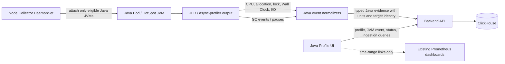

# feat: Expert Java Profiling Incident Workflow

## Summary

This plan upgrades the Java/Kubernetes profiler from a basic profile viewer into an expert incident-analysis workflow for Java services. It keeps the product Java-only and HotSpot-first while adding explicit profile semantics, Pod-level variance/drill-down, UI noise controls, source-copy ergonomics, and new Java Wall Clock, GC, and I/O evidence derived from JVM/async-profiler/JFR-capable data rather than general multi-language system profiling.

---

## Problem Frame

During P0/P1 Java production incidents, responders need profile data that is physically interpretable, instance-specific, and low-noise. The current UI can show CPU, allocation, lock, status, and ingestion evidence, but it still exposes large raw values and ambiguous percentages, can dilute a single bad Pod inside service-level aggregation, and does not yet provide Java Wall Clock, GC, or I/O blocking views that experts expect when CPU is not the bottleneck.

---

## Requirements

- R1. Preserve the product boundary: this is a Java program profiler for Kubernetes workloads, not a general multi-language eBPF observability platform.
- R2. Replace raw profile values in the UI with profile-type-aware human units and explicit percentage baselines.
- R3. Show enough baseline context for CPU, Wall Clock, allocation, lock, GC, and I/O values that a responder can decide whether a finding is material.
- R4. Support Pod/JVM-level drill-down and service-level variance so single-instance skew is not hidden by aggregation.
- R5. Add Java Wall Clock profiling for blocked, sleeping, waiting, or I/O-heavy Java execution paths.
- R6. Add Java GC evidence that can be correlated with allocation profiles and incident time ranges.
- R7. Add Java I/O evidence for socket/file blocking paths where JVM/JFR-capable events can identify Java ownership.
- R8. Provide UI controls to hide native/system/runtime frames while preserving the ability to inspect them when needed.
- R9. Improve Top Table expert workflows: sortable Self/Total columns, full symbol/method visibility, and copyable stack or frame context.
- R10. Clearly disclose current support limits for async context stitching, JIT/inlining recovery, virtual threads, and unsupported JVM/runtime cases.
- R11. Keep all collected data subject to the existing bounded retention rule: no profile, JVM event, thread, status, ingestion, or raw artifact data retained for more than 7 days.
- R12. Extend real Kubernetes acceptance so completion requires non-empty Java Wall Clock, GC, and I/O evidence in addition to existing CPU, allocation, lock, ClickHouse, UI, and no-restart checks.
- R13. Keep the first expert UI release focused on a single selected Java Pod CPU profile workflow; A/B comparison, service rollup, Wall Clock, GC, and I/O detail panes may land behind later evidence-view phases rather than in the first MVP screen.

**Origin actors:** Java Service Owner, Incident Responder, Platform Operator.
**Origin flows:** opt-in profiling, incident temporary profiling, service and Pod analysis, retention cleanup, thread/profile diagnosis.
**Origin acceptance examples:** service profile rendering, Pod drill-down for allocation spikes, retention cleanup, memory/GC correlation, slow-thread and busy-thread analysis.

---

## Scope Boundaries

- The implementation must remain Java/HotSpot-compatible JVM profiling only. It must not introduce generic process profiling for Go, Node.js, Python, C/C++, or arbitrary container processes.
- The UI may expose links or time-range context for Prometheus dashboards, but it must not duplicate Prometheus as a metrics store, dashboard builder, alerting surface, tracing UI, topology UI, or log viewer.
- Pyroscope, Parca, Grafana, or other profile backends must not become required runtime dependencies.
- Async context stitching and JIT/inlining recovery are included as explicit capability disclosure and design groundwork; production-grade cross-thread request reconstruction is not required before the Java Wall Clock, GC, and I/O evidence lands.
- Retained heap ownership remains out of scope unless a heap dump or future retained-heap feature is separately designed. Allocation profiles must not be presented as retained heap.

### Deferred to Follow-Up Work

- Full async context stitching across WebFlux, Netty, `CompletableFuture`, and virtual-thread handoff: separate design and implementation after the current JVM event model can expose honest capability limits.
- Source repository integration or IDE deep links: defer beyond copyable stack/frame context unless a concrete source-indexing design is approved.
- Non-HotSpot JVM support: remains a future compatibility effort; unsupported JVMs must continue to be skipped with explicit status.

---

## Context & Research

### Relevant Code and Patterns

- `collector/internal/jfr/normalizer.go` already converts CPU execution samples to nanoseconds with `DefaultCPUExecutionSampleValueNS`, while allocation and lock values use profile-specific units.
- `collector/internal/jfr/parser.go`, `collector/internal/jfr/aggregate.go`, and `collector/internal/pipeline/profile_batcher.go` are the collector-side extension points for new Java/JFR-derived event types.
- `backend/internal/app/query_flamegraph.go` and `backend/internal/app/query_top_stacks.go` query and rank profile samples but currently return raw `uint64` values and string percentages.
- `backend/internal/clickhouse/profile_repository.go` already filters by namespace, service, Pod, profile type, and time range; this pattern should be extended rather than replaced.
- `backend/internal/domain/flamegraph_builder.go` is the right layer for tree metadata such as unit/baseline information and native-frame filtering flags.
- `web/src/api/types.ts`, `web/src/features/cpu/cpu-view.tsx`, `web/src/features/memory/memory-view.tsx`, `web/src/features/locks/locks-view.tsx`, and `web/src/visualization/flamegraph.tsx` are the UI/API surfaces for profile semantics, top tables, frame classification, focus/search/reset, and profile-type-specific views.
- `docs/operations/real-profiling-acceptance-standard.md` is mandatory for changes touching collector profiling, ingestion, ClickHouse storage, backend query APIs, Kubernetes deployment, demo workload, or profile UI.

### Institutional Learnings

- Keep collection node-local, service-centric, bounded, and aligned with the documented architecture.
- Preserve the boundary between profiling evidence and metric dashboards: metrics stay in Prometheus-series systems; this product shows Java profiles, thread evidence, target status, and ingestion health.
- Real acceptance must prove non-empty profile data and real UI workflows, not only healthy pods.

### External References

- async-profiler officially supports CPU, allocation, lock, Wall Clock, multiple-event JFR output, native/JVM frames, and HotSpot-specific stack walking: https://github.com/async-profiler/async-profiler
- async-profiler profiling modes document Wall Clock sampling, Java lock profiling, and multi-event JFR output: https://github.com/async-profiler/async-profiler/blob/master/docs/ProfilingModes.md
- async-profiler options document intervals, wall options, stack depth, and stack walking features such as `comptask`, `vtable`, and `pcaddr`: https://github.com/async-profiler/async-profiler/blob/master/docs/ProfilerOptions.md
- Oracle JDK 21 `jdk.jfr` documentation describes JFR events, timestamps, durations, settings, and typed metadata such as timespan, data amount, frequency, and percentage: https://docs.oracle.com/en/java/javase/21/docs/api/jdk.jfr/jdk/jfr/package-summary.html

---

## Key Technical Decisions

- Keep new evidence Java-scoped: Wall Clock, GC, and I/O must be represented as Java/JVM target evidence tied to namespace/service/Pod/container/JVM identity, not as node-wide eBPF or OS-wide telemetry.
- Add semantics at the API boundary, not only in React formatting: backend responses should carry value unit, display unit, baseline description, and percentage basis so CLI/UI/docs all explain the same numbers.
- Treat CPU sample values as nanoseconds first: the collector already normalizes CPU events to time, so the UI should present CPU time and average cores over the selected window rather than raw integer values.
- Keep native/runtime frames available but filterable: experts need a default low-noise Java ownership view while still being able to inspect JVM/native evidence when the issue is JNI, runtime, or kernel-adjacent.
- Use a two-track Java evidence model: profile samples for stack-bearing flamegraph/top-table evidence, JVM events for timestamped metadata-heavy evidence such as GC pauses or I/O events without usable stacks. Both tracks share target identity, time range, retention, ingestion health, and capability metadata.
- Make capability gaps visible in-product: async context stitching, JIT/inlining recovery, virtual-thread behavior, and missing event support should appear as capability notes or target status details instead of hidden limitations.

---

## Open Questions

### Resolved During Planning

- Should Wall Clock, GC, and I/O be active current scope or future roadmap? Resolved: active current scope, limited to Java/JVM evidence.
- Should the plan target all languages because eBPF is involved? Resolved: no; the plan explicitly targets Java programs only.

### Deferred to Implementation

- Exact JFR event names and parser mappings for GC and I/O: verify against the parser library and generated async-profiler/JFR payloads during implementation.
- Exact Wall Clock interval and overhead defaults: choose conservative production defaults after validating data volume and acceptance workload behavior.
- Exact CPU quota/baseline source: prefer Kubernetes resource limits and cgroup data where available, with a clear fallback to selected-window total profile time when quota is unavailable.
- Whether JIT/inlining metadata can be extracted from current JFR parser output: disclose limitations if the current parser cannot preserve the required metadata without a dependency upgrade.

---

## High-Level Technical Design

> *This illustrates the intended approach and is directional guidance for review, not implementation specification. The implementing agent should treat it as context, not code to reproduce.*

### Service Diagnosis Workspace Hierarchy

The UI is an app workspace for incident response, not a dashboard card grid. `DESIGN.md` is now the source of truth for visual direction. The first MVP screen should answer, in order: what single Java Pod/JVM target is selected, whether CPU profile evidence is trustworthy, which Java methods dominate, and how to copy/share the selected frame context.

The broader product still needs service skew, Wall Clock, GC, I/O, and A/B comparison, but these should be added as follow-on evidence views after the single-Pod CPU workflow is stable. The initial implementation must not force all evidence dimensions into the first screen.

```text
MVP JAVA POD CPU WORKSPACE

1. Context Bar
   namespace / service / selected Pod-JVM / time range / evidence freshness

2. Evidence Health Strip
   collection status | freshness lag | drop rate | sample frequency | CPU quota baseline

3. Evidence Navigation
   MVP: CPU
   Later profiles: Wall Clock | Allocation | I/O | Locks
   Later JVM events: GC | Deadlocks

4. Primary Evidence Pane
   CPU Top Table + Flamegraph + Both mode

5. Detail Drawer
   selected Java frame | FQCN/method signature | units/baseline | stack path | copy/share/focus actions
```

The evidence health strip earns its pixels by preventing false confidence. It should show compact status and collection semantics, not long tutorial copy. Service skew, A/B comparison, event correlation, and AI interpretation blocks are intentionally out of the first MVP screen.

### App UI Rules

- Do not turn evidence health into a dashboard-card mosaic. Use one compact strip with collection status, freshness, drop rate, sample frequency, and CPU quota baseline in the MVP.
- Cards are allowed for repeated rows/items, modals, and detail drawer sections; they should not be used as decorative page-section wrappers.
- The primary evidence pane must get the most vertical space. Flamegraphs and top tables outrank explanatory copy in the MVP; event timelines belong to later JVM event phases.
- Use compact icon buttons with accessible labels/tooltips for secondary actions such as copy, focus, reset, and help.
- Tutorial or interpretation guidance belongs behind help affordances or in the detail drawer, not as persistent text above the evidence.
- Avoid profile-type rainbow UI. Use restrained colors with one clear accent for selection/warning and semantic status colors only where they earn their pixels.
- Truncated text must expose the full value on hover and keyboard focus. Long class names, Pod names, JVM IDs, and frame paths are normal data, not edge cases.

### Lightweight UI Vocabulary

Project-wide `DESIGN.md` now exists and must be read before implementing UI. This plan keeps a small implementation vocabulary aligned with that design source of truth.

| UI element | Purpose | Rules |
|------------|---------|-------|
| View shell | Shared Java profile frame | One context bar, one evidence health strip, one primary evidence pane, one selected-frame drawer |
| Evidence health strip | Trust and collection orientation | Compact inline status groups; no decorative cards; show freshness, drop rate, sample frequency, and CPU quota baseline |
| Evidence navigation | Switch between evidence types | MVP exposes CPU first; later entries may be disabled or hidden until their backend evidence is real |
| Evidence pane | Main work surface | MVP profile evidence uses Top Table / Flamegraph / Both; event timelines wait for JVM event phases |
| Detail drawer | Selected frame context | Preserve target/time context; show full identifiers; include copy/share/focus actions and capability notes |
| Status badge | State at a glance | Short text plus semantic color; must have accessible label and not rely on color alone |
| Warning line | Partial, stale, unsupported, or truncated evidence | One concise line near affected evidence with link/action to Status or Ingestion when relevant |
| Icon button | Secondary actions | Use lucide icons where available; 44px touch target; tooltip and accessible label required |
| Tooltip / popover | Full identifiers and short explanations | Trigger on hover and keyboard focus; never be the only place critical error state appears |

### Responsive and Accessibility Requirements

The profiler workspace is desktop-first because flamegraphs and top tables need room, but it must degrade intentionally on narrower screens and remain keyboard/screen-reader usable.

**Responsive layout**
- Desktop, `>= 1200px`: context bar and triage strip stay at the top; evidence navigation sits below; profile views can use split Top Table / Flamegraph layout; detail drawer opens on the right.
- Tablet, `768px-1199px`: evidence pane may stack Top Table above Flamegraph; detail drawer collapses below the selected evidence; triage strip wraps into two compact rows without becoming cards.
- Mobile, `< 768px`: context remains visible but compact; evidence navigation becomes horizontally scrollable grouped tabs; Top Table or event summary appears before deep flamegraph/timeline detail; flamegraph uses fit-to-width or horizontal scroll with readable row height.

**Accessibility**
- Evidence tabs, mode switches, flamegraph frames, table rows, focus/reset/back controls, and copy/help buttons must be keyboard reachable.
- Flamegraph frame buttons need accessible names that include frame name, self value, total value, percent basis, and depth.
- Tooltips/popovers must open on keyboard focus as well as hover.
- Status badges and warnings must not rely on color alone; include text or accessible labels.
- Copy success/failure must be announced through an `aria-live` region and provide selectable fallback text on clipboard failure.
- Interactive controls need at least 44px touch targets or equivalent hit area.
- Text truncation must preserve full values for assistive technology and keyboard users.

### UI Interaction State Matrix

Each empty or partial state must explain what the user can conclude and what to do next. Avoid generic "No data" text because it hides the difference between unsupported capability, empty time range, ingestion failure, filtered-out Pod, and healthy-but-quiet evidence.

| Feature | Loading | Empty | Error | Success | Partial |
|---------|---------|-------|-------|---------|---------|
| Context / triage strip | Stable skeleton with current filters retained | "No Java target selected or discovered" with Status as primary next action | Query failure with retry and Ingestion link | Freshness, target status, ingestion status, skew, dominant evidence type | Stale or mixed evidence window labeled with affected evidence types |
| Pod/JVM drill-down | Row skeletons sized like final rows | Single target state explains no variance to compare | Status/summary unavailable with retry | Per-Pod/JVM contribution and skew cue | Some Pods/JVMs missing status or profile evidence, shown as incomplete not zero |
| Profile evidence pane | Bounded graph/table skeleton | No samples for selected target/time/profile type, with time-range and ingestion hints | Query failed with retry and copied diagnostic context | Top Table plus Flamegraph/Both with semantic units | Truncated samples/nodes shown in metadata and warning line |
| JVM event pane | Timeline/table skeleton | No events in range, distinct from unsupported capability | Query failed with retry and Ingestion link | Summary stats plus event timeline/table and correlation panel | Event cap reached or metadata incomplete, with visible omitted count |
| Capability notes | Compact "checking support" state | Not applicable for this evidence type | Unknown support state with status reason | Supported or supported-with-limits explanation | Partial support lists missing fields or separate evidence windows |
| Copy actions | Busy feedback on the icon/button | Disabled with reason when no frame/event selected | Clipboard failure shows fallback selectable text | Copied confirmation includes what was copied | Copy includes partial/truncated warning when evidence is incomplete |

### Incident Responder Journey

The UI should be designed around symptom-to-evidence flow. A responder often arrives from an alert or Prometheus chart and needs a fast path to trustworthy Java ownership evidence.

| Step | User does | User feels | UI must do |
|------|-----------|------------|------------|
| 1 | Opens service diagnosis during an incident | Time-boxed and suspicious of stale data | Confirm selected Java target, time range, freshness, target status, and ingestion state without requiring a tab switch |
| 2 | Checks whether the issue is service-wide or one instance | Looking for skew before detail | Show service-level Pod/JVM variance before the flamegraph consumes attention |
| 3 | Chooses evidence by symptom | Overloaded by possible causes | Triage strip points toward CPU, Wall Clock, GC, I/O, allocation, or lock evidence using compact status and dominance cues |
| 4 | Drills into a hot frame or event | Focused, needs context preserved | Keep namespace/service/Pod/JVM/time context visible while the detail drawer shows frame/event metadata |
| 5 | Copies evidence to incident chat, Jira, or IDE | Under pressure, needs a complete packet | Copy one complete payload with target identity, time range, evidence type, units, percent basis, frame/event details, and partial warnings |
| 6 | Encounters unsupported or partial evidence | Suspicious of the tool | Explain the limitation and the next best action, such as changing time range, checking ingestion, or using CPU/allocation/lock evidence |

```text
DELIVERY DEPENDENCY SHAPE

MVP Java Pod CPU workbench
  U1 Profile semantics
  U6 Frame filtering/capability notes for CPU
  U7 Top table/copy workflows for CPU
        |
        v
Foundation for broader evidence
  U8 Evidence storage/query/retention foundation
  U2 Pod/JVM drill-down and service variance
        |
        v
First new evidence type
  U3 Java Wall Clock
        |
        v
Additional Java JVM evidence
  U4 GC events
  U5 I/O events
        |
        v
Expanded expert incident UI
  Wall/GC/I/O panes
  service rollup
  time-window A/B comparison
        |
        v
Acceptance and docs
  U9 Real Java acceptance + docs
```



The core rule is that every value crossing the backend/UI boundary must carry its physical meaning. A frame value is not just a number; it is CPU time, Wall Clock time, allocation bytes, object count, lock delay, lock count, GC pause duration, I/O duration, or I/O bytes/count, with a baseline that explains what the percentage means.

### Java Evidence Data Model

```text
JavaEvidence
  shared identity: namespace, service, pod, container, process/JVM, node, time range
  shared controls: retention <= 7 days, ingestion health, query limits, capability status

  ├── ProfileSample track
  │     shape: stack frames + numeric value + profile type
  │     examples: CPU, allocation, lock delay/count, Wall Clock, stack-bearing I/O
  │     query: flamegraph, top table, frame inspector
  │
  └── JVMEvent track
        shape: timestamp/duration + event metadata + optional stack
        examples: GC pause, GC cause/action, socket/file I/O without usable stack
        query: event timeline, summary stats, correlation panels
```

Do not force GC pauses into `ProfileSample` just to reuse flamegraph code. Do not force Wall Clock out of `ProfileSample` if it has stack-bearing samples. The shared abstraction is identity, semantics, retention, health, and capability reporting, not one universal row shape.

### Java Evidence Collection Mode Matrix

| Evidence | Preferred collection mode | Must not break | Capability behavior |
|----------|---------------------------|----------------|---------------------|
| CPU | Existing async-profiler primary session using CPU sampling | Existing CPU flamegraph/top table and acceptance data | Required for strict profiling on supported HotSpot JVMs |
| Allocation bytes/objects | Existing async-profiler JFR allocation options in the CPU session when supported | CPU session continuity and upload cadence | Required for strict profiling when allocation support is enabled |
| Lock count/delay | Existing async-profiler JFR lock options in the CPU session when supported | CPU/allocation data and lock-delay semantics | Required for strict profiling when lock support is enabled |
| Wall Clock | Prefer an explicit Java evidence mode that does not replace CPU sampling; use a separate bounded phase/session if async-profiler cannot emit CPU and Wall Clock in one usable JFR stream | CPU/allocation/lock evidence in the same incident window | Capability-detected; unsupported/partial state is visible per target |
| GC | JVM/JFR event evidence keyed by the same target/time identity, not a stack-only profile pretending to be allocation ownership | Allocation semantics and retained-heap boundary | Capability-detected; absence of GC events is distinguishable from parser failure |
| I/O | JVM/JFR-visible Java socket/file I/O evidence; stack profile when frames are available, event table when only event metadata is available | Java-only scope and CPU/Wall Clock profile correctness | Capability-detected; no node-wide non-Java I/O fallback |

Collector implementation should treat this matrix as the contract. Adding Wall Clock must not simply replace `itimer` CPU collection. If the underlying profiler cannot emit the desired evidence together, the collector should use explicit bounded phases and annotate the resulting evidence window so the UI does not imply perfect simultaneity.

### Production Budget Gates

These budgets are planning targets and acceptance gates. Implementation may choose stricter defaults, but it should not silently exceed these without updating the requirements and acceptance standard.

| Budget | Gate |
|--------|------|
| Target safety | Strict real acceptance must show no target workload restart increase and no new sustained error state after profiling. |
| Collection window | Any extra Wall Clock phase must be bounded by the temporary profiling window and reported as a distinct evidence window when it is not simultaneous with CPU. |
| Collector output | Profile/event batching must enforce per-target sample/event caps, record dropped/truncated counts, and keep local buffering bounded under high-volume load. |
| Backend ingestion | New evidence types must expose accepted/rejected/dropped/truncated counters and batch size metadata through ingestion health and exporter metrics. |
| ClickHouse query | Flamegraph, top table, JVM event timeline, and service variance queries must have explicit row/node limits, partial metadata, and query-duration metrics. |
| UI rendering | Large result sets must render from bounded/partial backend responses; the browser must not need to render unbounded frame/event lists to stay responsive. |

Real acceptance should fail strict mode when budget evidence is missing, not only when pods crash. A passing run needs positive proof that the profiler produced useful Java evidence while staying inside bounded collection, ingestion, query, and UI behavior.

---

## Implementation Units

### U1. Profile Semantics Contract and Unit Formatting

**Goal:** Make every profile response explain value units, display units, and percentage basis so responders no longer see ambiguous raw numbers.

**Requirements:** R2, R3, R9, R11

**Dependencies:** None

**Files:**
- Modify: `backend/internal/domain/types.go`
- Modify: `backend/internal/app/query_flamegraph.go`
- Modify: `backend/internal/app/query_top_stacks.go`
- Modify: `backend/internal/httpapi/query_handlers.go`
- Modify: `web/src/api/types.ts`
- Modify: `web/src/visualization/flamegraph.tsx`
- Modify: `web/src/features/cpu/cpu-view.tsx`
- Modify: `web/src/features/memory/memory-view.tsx`
- Modify: `web/src/features/locks/locks-view.tsx`
- Test: `backend/internal/app/query_top_stacks_test.go`
- Test: `backend/internal/domain/flamegraph_builder_test.go`
- Test: `backend/internal/httpapi/query_handlers_test.go`
- Test: `web/src/visualization/flamegraph.test.tsx`
- Test: `web/src/features/cpu/cpu-view.test.tsx`

**Approach:**
- Add response metadata describing `value_unit`, `display_unit`, `sample_basis`, `percentage_basis`, selected time range, and baseline availability.
- Convert CPU and Wall Clock nanoseconds into readable durations and average cores over the selected window when the baseline window is known.
- Preserve raw values for precise sorting and machine use, but make human display use typed formatting.
- Replace ambiguous labels such as `Total CPU` on generic flamegraph frames with profile-type-aware labels.

**Execution note:** Add backend contract tests before changing UI rendering so semantic regressions fail outside the browser.

**Patterns to follow:**
- Existing `PartialMetadata` response pattern in `web/src/api/types.ts`.
- Existing `TopStackRow` and `FlamegraphResult` builders in `backend/internal/app` and `backend/internal/domain`.

**Test scenarios:**
- Happy path: CPU top-stack rows with nanosecond values return raw values plus formatted duration, average cores, and percent basis for the selected window.
- Happy path: allocation bytes, allocation objects, lock contention count, and lock delay each render their correct unit labels and do not reuse CPU wording.
- Edge case: missing selected-window baseline still returns raw values and a visible “percentage of returned profile samples” basis rather than implying Pod CPU quota.
- Edge case: zero-value roots and partial results keep existing empty/partial behavior while still returning semantic metadata.
- Integration: `/query/top-stacks` and `/query/flamegraph` responses remain backward-compatible enough for current UI fields while adding semantic metadata.

**Verification:**
- Backend tests prove profile-type-specific units and percentage basis are returned.
- Web tests prove the UI no longer displays large raw CPU integers as the primary label.

### U2. Pod/JVM Drill-Down and Service Variance

**Goal:** Prevent service-level aggregation from hiding one bad Pod or JVM by exposing Pod/JVM filters, variance summaries, and skew cues.

**Requirements:** R4, R11, R12

**Dependencies:** U1

**Files:**
- Modify: `backend/internal/app/query_service_summary.go`
- Modify: `backend/internal/app/query_status.go`
- Modify: `backend/internal/clickhouse/profile_repository.go`
- Modify: `backend/internal/httpapi/query_handlers.go`
- Modify: `web/src/routes/service-overview.tsx`
- Modify: `web/src/features/status/target-status-view.tsx`
- Modify: `web/src/features/cpu/cpu-view.tsx`
- Modify: `web/src/features/memory/memory-view.tsx`
- Modify: `web/src/features/locks/locks-view.tsx`
- Test: `backend/internal/app/query_status_test.go`
- Test: `backend/internal/app/query_top_stacks_test.go`
- Test: `backend/internal/httpapi/query_handlers_test.go`
- Test: `web/src/features/status/target-status-view.test.tsx`
- Test: `web/src/app.test.tsx`

**Approach:**
- Extend service summary responses with per-Pod and per-JVM contribution totals for selected profile types and time ranges.
- Add UI drill-down controls for namespace, service, Pod, container, and JVM/process identity without removing the service-centric default.
- Show a compact variance/skew summary for service views, highlighting when one Pod dominates a resource dimension.
- Preserve release-window safety by displaying Pod and JVM identity context alongside PID, since PID alone can be reused.

**Patterns to follow:**
- Existing target status table already surfaces Pod and process identity.
- Existing repository query filters already include namespace, service, Pod, profile type, and time range.

**Test scenarios:**
- Happy path: a service with three Pods shows each Pod contribution and flags the Pod that dominates CPU or Wall Clock time.
- Happy path: selecting one Pod updates CPU, memory, lock, Wall Clock, GC, I/O, status, and ingestion queries to the same target context.
- Edge case: service-level view with one Pod behaves the same as today but still shows the selected identity.
- Edge case: two JVMs in one Pod are distinguishable by container/process/JVM metadata when status data is available.
- Integration: backend query handlers pass Pod filters through to ClickHouse-backed repositories and in-memory repositories consistently.

**Verification:**
- A responder can identify whether a service-level hotspot is broad or isolated to one Pod before opening a flamegraph.

### U3. Java Wall Clock Profiling

**Goal:** Add Java Wall Clock evidence for blocked, sleeping, waiting, or remote-call-heavy execution where CPU profiles are insufficient.

**Requirements:** R1, R3, R5, R10, R11, R12

**Dependencies:** U1, U2, U8

**Files:**
- Modify: `domain/profile_type.go`
- Modify: `collector/internal/profiler/async_profiler.go`
- Modify: `collector/internal/jfr/parser.go`
- Modify: `collector/internal/jfr/normalizer.go`
- Modify: `collector/internal/jfr/aggregate.go`
- Modify: `collector/internal/pipeline/profile_batcher.go`
- Modify: `backend/internal/app/query_flamegraph.go`
- Modify: `backend/internal/app/query_top_stacks.go`
- Modify: `web/src/features/cpu/cpu-view.tsx`
- Create: `web/src/features/wall-clock/wall-clock-view.tsx`
- Create: `web/src/features/wall-clock/wall-clock-view.test.tsx`
- Test: `collector/internal/profiler/async_profiler_test.go`
- Test: `collector/internal/jfr/parser_test.go`
- Test: `collector/internal/jfr/normalizer_test.go`
- Test: `collector/internal/jfr/aggregate_test.go`
- Test: `backend/internal/clickhouse/profile_repository_test.go`
- Test: `backend/internal/app/query_top_stacks_test.go`

**Approach:**
- Extend the contracts and storage/query shape established by U8 rather than redefining shared schema in this unit.
- Add a Java Wall Clock profile type using async-profiler/JFR-capable collection for HotSpot JVMs.
- Follow the collection mode matrix: Wall Clock must not replace existing CPU sampling; if it cannot share a usable JFR stream with CPU/allocation/lock, collect it in an explicit bounded phase and mark the evidence window accordingly.
- Keep Wall Clock scoped to Java targets selected through existing Kubernetes opt-in policy.
- Store Wall Clock stack samples with nanosecond duration semantics and query them through the existing flamegraph/top-stack path.
- Add a dedicated UI view or tab for Wall Clock so CPU and blocked-time evidence are not conflated.
- Include capability notes explaining that Wall Clock shows thread-state-inclusive sampled time and does not automatically stitch async request context.

**Patterns to follow:**
- Existing CPU profile type normalization and upload path.
- Existing `cpu-view` Top Table / Flame Graph / Both mode interaction.

**Test scenarios:**
- Happy path: parsed Wall Clock events normalize to the new profile type with nanosecond values and Java target identity.
- Happy path: enabling Wall Clock does not remove or degrade CPU/allocation/lock samples for the same Java target in strict profiling mode.
- Edge case: if Wall Clock must run in a separate bounded phase, backend metadata and UI copy describe the evidence window instead of implying exact simultaneity with CPU samples.
- Happy path: backend queries return a non-empty Wall Clock flamegraph and top table for a selected Pod/time range.
- Edge case: if Wall Clock collection is unsupported by the runtime or profiler build, target status or profile metadata explains the unsupported capability without marking unrelated CPU/allocation/lock data failed.
- Error path: Wall Clock parser failures are reported through ingestion health with rejected/truncated context rather than silently dropping the whole batch.
- Integration: UI renders Wall Clock with duration/average-thread-time semantics and can search, select, focus, Back, and Reset like CPU.

**Verification:**
- Real acceptance can prove non-empty Java Wall Clock data for the demo workload without increasing target workload restarts.

### U4. Java GC Event Evidence and Allocation Correlation

**Goal:** Add a GC view that correlates Java allocation pressure with GC pause/event evidence for the same service, Pod, JVM, and time range.

**Requirements:** R1, R3, R6, R10, R11, R12

**Dependencies:** U1, U2, U8

**Files:**
- Modify: `collector/internal/jfr/parser.go`
- Modify: `collector/internal/jfr/normalizer.go`
- Modify: `collector/internal/pipeline/profile_batcher.go`
- Modify: `backend/internal/app/query_service_summary.go`
- Modify: `backend/internal/httpapi/query_handlers.go`
- Create: `backend/internal/app/query_gc_events.go`
- Create: `backend/internal/app/query_gc_events_test.go`
- Create: `web/src/features/gc/gc-view.tsx`
- Create: `web/src/features/gc/gc-view.test.tsx`
- Modify: `web/src/features/memory/memory-view.tsx`
- Test: `collector/internal/jfr/parser_test.go`
- Test: `collector/internal/jfr/normalizer_test.go`
- Test: `backend/internal/clickhouse/profile_repository_test.go`
- Test: `backend/internal/httpapi/query_handlers_test.go`

**Approach:**
- Extend the JVM event track established by U8 rather than adding a separate GC-specific persistence path.
- Model GC evidence as Java/JVM events with timestamps, duration, collector/action/cause when available, and target identity.
- Store GC events under the same 7-day bounded retention policy as profile data.
- Correlate GC pauses with allocation bytes/object profiles in the UI using shared time range and target identity.
- Keep retained-heap claims out of scope; the UI should explain that GC/allocation correlation is not retained-object ownership.

**Patterns to follow:**
- Existing thread diagnosis and deadlock event query patterns for non-flamegraph JVM evidence.
- Existing memory view wording that avoids presenting allocation as retained heap.

**Test scenarios:**
- Happy path: collector parses GC pause events with duration and target identity and backend returns them for a selected time range.
- Happy path: UI shows GC pause count, total pause time, max pause, and nearest allocation hotspots for the same Pod/JVM context.
- Edge case: no GC events but non-empty allocation data shows a clear “no GC event evidence in this range” state, not an error.
- Error path: malformed or unsupported GC events are counted in ingestion health without corrupting other profile samples.
- Integration: selecting a Pod in the service context filters both allocation and GC evidence consistently.

**Verification:**
- A responder can confirm whether allocation pressure and GC pauses coincide for the affected Java Pod and time window.

### U5. Java I/O Blocking Evidence

**Goal:** Add Java I/O evidence for socket/file blocking paths so responders can distinguish CPU bottlenecks from remote RPC, network, or disk waits.

**Requirements:** R1, R3, R7, R10, R11, R12

**Dependencies:** U1, U2, U3, U8

**Files:**
- Modify: `domain/profile_type.go`
- Modify: `collector/internal/jfr/parser.go`
- Modify: `collector/internal/jfr/normalizer.go`
- Modify: `collector/internal/jfr/aggregate.go`
- Modify: `backend/internal/app/query_flamegraph.go`
- Modify: `backend/internal/app/query_top_stacks.go`
- Create: `web/src/features/io/io-view.tsx`
- Create: `web/src/features/io/io-view.test.tsx`
- Test: `collector/internal/jfr/parser_test.go`
- Test: `collector/internal/jfr/normalizer_test.go`
- Test: `backend/internal/app/query_top_stacks_test.go`
- Test: `web/src/visualization/flamegraph.test.tsx`

**Approach:**
- Extend the U8 profile-sample or JVM-event track depending on whether the I/O evidence has usable Java stack frames.
- Prefer JVM/JFR-visible Java socket/file I/O evidence that preserves Java stack ownership and target identity.
- If exact I/O stack samples are represented differently from existing profile samples, keep the API explicit about event type, duration, byte count, and operation where available.
- Do not collect arbitrary node-level I/O for non-Java processes.
- In the UI, separate I/O wait evidence from CPU and Wall Clock while allowing cross-navigation between related frames/time ranges.

**Patterns to follow:**
- Existing lock-delay profile semantics for duration-based non-CPU waits.
- Existing flamegraph and top-table views when stack samples are available.

**Test scenarios:**
- Happy path: Java socket/file I/O events normalize with target identity, operation metadata where available, and duration or byte units.
- Happy path: backend returns I/O top stacks sorted by total wait duration for a selected Java Pod.
- Edge case: environments without I/O event support show a capability limitation state, not empty success.
- Error path: unsupported or partial I/O events are surfaced in ingestion health and query metadata.
- Integration: I/O view respects service, Pod, JVM, and time-range filters shared with Wall Clock and CPU.

**Verification:**
- A responder can tell whether a slow Java service profile is dominated by CPU, Wall Clock waiting, or Java I/O blocking evidence.

### U6. Frame Classification, Native/System Toggle, and JVM Capability Notes

**Goal:** Reduce flamegraph noise while preserving expert access to runtime/native frames and support-limit explanations.

**Requirements:** R8, R10

**Dependencies:** U1

**Files:**
- Modify: `backend/internal/domain/flamegraph_builder.go`
- Modify: `backend/internal/app/query_flamegraph.go`
- Modify: `backend/internal/httpapi/query_handlers.go`
- Modify: `web/src/visualization/flamegraph.tsx`
- Modify: `web/src/styles.css`
- Test: `backend/internal/domain/flamegraph_builder_test.go`
- Test: `backend/internal/httpapi/query_handlers_test.go`
- Test: `web/src/visualization/flamegraph.test.tsx`
- Test: `web/tests/real-acceptance.spec.ts`

**Approach:**
- Keep classifying frames as application Java, JVM/runtime, or native/system, but add an explicit toggle to hide runtime/native frames.
- When hiding frames, preserve aggregate values by folding or summarizing hidden frames rather than making percentages lie.
- Add capability notes for async context stitching, JIT/inlining recovery, virtual threads, and native frame visibility based on available data.
- Move persistent instructional text into compact help affordances so the flamegraph gets more vertical space.

**Patterns to follow:**
- Existing `classifyFrame` and legend behavior in `web/src/visualization/flamegraph.tsx`.
- Existing real acceptance expectations for search, focus, Back, Reset, selected-frame inspector, and frame categories.

**Test scenarios:**
- Happy path: toggling hidden native/system frames removes noisy frames visually while totals and selected-frame details remain coherent.
- Happy path: native/system frames remain inspectable when the toggle is disabled.
- Edge case: a stack containing only runtime/native frames shows a clear folded/filtered state instead of an empty graph.
- Integration: search, focus, Back, Reset, and selected-frame inspector work in both full and filtered modes.

**Verification:**
- Real UI acceptance captures both filtered and unfiltered flamegraph states from real backend data.

### U7. Top Table Expert Ergonomics and Copy Workflows

**Goal:** Make the Top Table usable under incident pressure by supporting sorting, full method visibility, and copyable context.

**Requirements:** R2, R8, R9

**Dependencies:** U1, U6

**Files:**
- Modify: `web/src/features/cpu/cpu-view.tsx`
- Modify: `web/src/features/memory/memory-view.tsx`
- Modify: `web/src/features/locks/locks-view.tsx`
- Modify: `web/src/features/wall-clock/wall-clock-view.tsx`
- Modify: `web/src/features/io/io-view.tsx`
- Modify: `web/src/visualization/flamegraph.tsx`
- Modify: `web/src/styles.css`
- Test: `web/src/features/cpu/cpu-view.test.tsx`
- Test: `web/src/features/hot-code-view.test.tsx`
- Test: `web/src/visualization/flamegraph.test.tsx`
- Test: `web/tests/profiling-flow.spec.ts`

**Approach:**
- Add sortable table headers for Self and Total values, preserving raw numeric sort even when display values are formatted.
- Add full symbol/method/location tooltip or expanded cell content so overloaded methods and long FQCNs are distinguishable.
- Add copy actions for selected frame, full stack path, and top-table row context using profile type, value semantics, target identity, and time range.
- Keep controls compact and icon-oriented where possible so they do not compete with the flamegraph.

**Patterns to follow:**
- Existing CPU Top Table and flamegraph selected-frame inspector behavior.
- Existing `lucide-react` dependency for icon buttons.

**Test scenarios:**
- Happy path: clicking Self sorts descending by raw self value, then toggles or preserves deterministic order as designed.
- Happy path: clicking Total sorts by raw total value and does not sort formatted strings lexicographically.
- Happy path: hovering or focusing a truncated symbol exposes the full class/method/location string.
- Happy path: copy selected stack includes namespace, service, Pod/JVM when selected, profile type, time range, frame path, self, total, units, and percentage basis.
- Edge case: clipboard failure falls back to selectable text or visible error state without breaking the table.
- Integration: selecting a Top Table row highlights matching flamegraph frames rather than destructively filtering the graph.

**Verification:**
- A responder can sort to the highest self-time leaf, distinguish exact methods, and copy evidence for an incident ticket without leaving the UI.

### U8. Backend Storage, Retention, and Query Health for New Java Evidence

**Goal:** Establish the shared Java evidence storage, query, retention, partial-result, and ingestion-health foundation that Wall Clock, GC, and I/O implementations plug into.

**Requirements:** R3, R5, R6, R7, R11, R12

**Dependencies:** U1, U2

**Files:**
- Modify: `contracts/profiling/types.go`
- Modify: `contracts/profiling/payloads.md`
- Modify: `domain/profile_type.go`
- Modify: `backend/internal/clickhouse/001_initial_profile_schema.sql`
- Modify: `backend/internal/clickhouse/schema.go`
- Modify: `backend/internal/clickhouse/profile_repository.go`
- Modify: `backend/internal/clickhouse/retention_repository.go`
- Modify: `backend/internal/app/query_ingestion_health.go`
- Modify: `backend/internal/metrics/exporter.go`
- Test: `backend/internal/clickhouse/profile_repository_test.go`
- Test: `backend/internal/clickhouse/retention_repository_test.go`
- Test: `backend/internal/app/query_ingestion_health_test.go`
- Test: `backend/internal/httpapi/query_handlers_test.go`
- Test: `backend/internal/metrics/exporter_test.go`
- Test: `tools/chdb-smoke` schema smoke coverage for profile-sample and JVM-event tables

**Approach:**
- Extend ClickHouse schema or add bounded tables using the two-track evidence model: stack-bearing evidence remains profile samples; timestamped metadata-heavy evidence uses JVM event rows.
- Keep both tracks queryable through shared namespace/service/Pod/JVM/time/capability filters.
- Land storage/query/retention contracts before individual evidence types rely on them; U3/U4/U5 should add their concrete event mappings into this foundation rather than inventing separate persistence paths.
- Keep query limits and partial metadata for new evidence so high-cardinality stacks or event bursts do not overload ClickHouse.
- Add ingestion/retention/exporter metrics for new evidence types so operators can see accepted, rejected, dropped, truncated, and expired data.
- Ensure TTL remains 7 days or less for every new table/artifact.
- Enforce the production budget gates with per-target caps, partial metadata, query-duration metrics, and strict acceptance evidence.

**Patterns to follow:**
- Existing profile schema, retention repository, ingestion health counters, and query limit tests.
- Existing real acceptance failure rules for dropped, truncated, split, or rejected batches.

**Test scenarios:**
- Happy path: profile-sample evidence and JVM-event evidence are inserted, queried by namespace/service/Pod/JVM/evidence type/time range, and expired by retention policy.
- Happy path: stack-bearing Wall Clock or I/O evidence can use flamegraph/top-table queries, while GC events use event summary/timeline queries.
- Happy path: HTTP query handlers expose JVM-event query contracts with semantic metadata and target filters, not only profile-sample contracts.
- Integration: chdb smoke coverage creates the dual-track schema, verifies TTL <= 7 days, inserts representative profile-sample and JVM-event rows, and queries required target/time/unit fields.
- Edge case: high-volume Java evidence batches return partial metadata rather than unbounded result sets.
- Error path: rejected Java evidence payloads increment ingestion health and exporter metrics with meaningful reasons.
- Integration: retention tests prove no new collected data type can exceed 7 days.
- Integration: high-volume acceptance proves dropped/truncated counters, query limits, and partial metadata are present when budgets are hit.

**Verification:**
- ClickHouse smoke tests and backend unit tests cover new schema/query/retention paths.

### U9. Documentation and Real Java Acceptance

**Goal:** Update docs and acceptance so the expanded Java-only profiler is validated with real data and clear user guidance.

**Requirements:** R1, R10, R11, R12

**Dependencies:** U1, U2, U3, U4, U5, U6, U7, U8

**Files:**
- Modify: `docs/brainstorms/java-profiler-requirements.md`
- Modify: `docs/architecture/java-profiler-architecture.md`
- Modify: `docs/operations/performance-analysis-user-manual.md`
- Modify: `docs/operations/java-profiling-runbook.md`
- Modify: `docs/operations/real-profiling-acceptance-standard.md`
- Modify: `docs/operations/e2e-automation-test-guide.md`
- Modify: `README.md`
- Modify: `AGENTS.md`
- Modify: `CLAUDE.md`
- Modify: `scripts/real-acceptance.sh`
- Modify: `web/tests/real-acceptance.spec.ts`
- Test: `web/tests/real-acceptance.spec.ts`

**Approach:**
- Update requirements and architecture at the same time because the active scope now includes Wall Clock, GC, and I/O.
- Make every doc say Java-only where scope could otherwise be mistaken for all-language profiling.
- Extend acceptance to require non-empty Wall Clock, GC, and I/O evidence from Java workloads when strict full profiling is requested.
- Add UI acceptance for unit/baseline explanations, Pod variance, native/system frame hiding, sortable top tables, copy workflows, and capability notes.

**Patterns to follow:**
- Existing real profiling acceptance standard and real UI evidence sections.
- Existing user manual warning style for retained heap and Prometheus boundaries.

**Test scenarios:**
- Happy path: strict real acceptance deploys current workspace images, enables Java profiling, and proves non-empty CPU, allocation, lock-delay, Wall Clock, GC, and I/O evidence.
- Happy path: browser acceptance validates Top Table, Flame Graph, Both, Self/Total semantics, search highlighting, selected-frame details, focus, Back, Reset, native-frame toggle, Pod drill-down, and ingestion evidence.
- Edge case: unsupported runtime capability is visible as a Java target capability limitation and does not falsely fail unrelated profile types.
- Error path: acceptance fails when new evidence is empty, stale, mocked, or only historical.
- Integration: no target workload restart increase is accepted for the expanded profiling run.

**Verification:**
- The real acceptance artifact set includes profile rows, GC/I/O evidence, UI screenshots, ingestion evidence, retention proof, and workload restart comparison.

---

## System-Wide Impact

- **Interaction graph:** Collector profiling options, JFR parsing, batch upload, backend ingestion, ClickHouse schema/query paths, HTTP query handlers, React profile views, and real acceptance all change together.
- **Error propagation:** Unsupported Wall Clock/GC/I/O capability must be distinguishable from attach failure, parser failure, ingestion rejection, empty query result, and filtered-out UI state.
- **State lifecycle risks:** New event tables and profile types must obey the same 7-day-or-less retention policy and must not leave raw artifacts behind after temporary profiling windows expire.
- **API surface parity:** Top stacks, flamegraphs, service summary, target status, ingestion health, and UI routes must use the same target identity and value semantics.
- **Integration coverage:** Unit tests alone will not prove this feature; strict real Kubernetes acceptance is required because collector/backend/UI behavior depends on real HotSpot/JFR/async-profiler data.
- **Unchanged invariants:** Kubernetes opt-in control, DaemonSet node-local collection, ClickHouse as primary profile query store, no required Pyroscope/Parca/Grafana backend, and Java-only scope remain unchanged.

---

## Risks & Dependencies

| Risk | Mitigation |
|------|------------|
| Expanded Wall Clock/GC/I/O collection increases overhead or data volume. | Use conservative defaults, query limits, partial metadata, ingestion health counters, and strict real acceptance with no workload restart increase. |
| New evidence queries overload ClickHouse or the browser during incidents. | Enforce production budget gates for batch size, row/node limits, query-duration metrics, partial metadata, and bounded UI rendering. |
| GC and I/O event availability differs across JDK versions or parser capabilities. | Treat support as capability-detected Java evidence; show unsupported/partial states explicitly and keep CPU/allocation/lock unaffected. |
| Percentages remain misleading if CPU quota or selected-window baseline is unavailable. | Return explicit `percentage_basis` metadata and fallback wording instead of implying Pod quota. |
| Native/system frame hiding could falsify flamegraph totals. | Fold/summarize hidden frames while preserving aggregate values and keep full-frame mode available. |
| New UI views drift from existing search/focus/reset behavior. | Reuse the existing flamegraph component and extend real browser acceptance for every profile mode. |
| Async context stitching and JIT/inlining expectations exceed available data. | Make support limits visible in capability notes and defer full cross-thread/inlining reconstruction to follow-up work. |

---

## Phased Delivery

- Phase 1: MVP Java Pod CPU workbench. Land U1 plus the CPU portions of U6 and U7 so the existing CPU evidence becomes interpretable, low-noise, sortable, searchable, copyable, and shareable for one selected Java Pod/JVM.
- Phase 2: Shared evidence foundation. Land U8 and the target-identity portions of U2 so later evidence types have a consistent storage/query/retention contract without forcing service rollup into the first UI.
- Phase 3: Java Wall Clock. Land U3 on top of the shared foundation because it is closest to the current async-profiler profile pipeline.
- Phase 4: Java GC and I/O. Land U4 and U5 as concrete JVM/JFR evidence types that plug into the shared foundation instead of creating separate persistence paths.
- Phase 5: Service rollup and comparison. Complete the variance portions of U2 and add time-window A/B comparison only after single-target evidence and units are proven.
- Phase 6: Documentation and strict acceptance. Land U9 and rerun real Kubernetes acceptance against images built from the current workspace.

---

## Documentation / Operational Notes

- Documentation must consistently state that Wall Clock, GC, and I/O evidence is Java/JVM-scoped and tied to selected HotSpot-compatible JVM targets.
- Runbooks should explain when to use CPU, Wall Clock, allocation, GC, I/O, locks, deadlocks, status, and ingestion views during an incident.
- UI help should explain percent baselines, average cores, duration units, allocation units, lock wait units, GC pause semantics, and I/O wait/byte semantics.
- Operators need new ingestion and retention metrics for the added evidence types so failures are visible in the existing Prometheus stack without adding a new dashboard backend dependency.
- Runbooks must document the budget gates and how to interpret dropped, truncated, partial, and unsupported evidence during an incident.

---

## Success Metrics

- Expert users no longer need to infer whether large profile values are nanoseconds, sample counts, bytes, counts, or percentages.
- Service-level views make single-Pod skew visible before a responder opens a flamegraph.
- Java Wall Clock, GC, and I/O evidence can be queried and rendered for real HotSpot demo workloads in strict acceptance.
- Strict acceptance proves production budget gates: no target restart increase, bounded batches, visible drop/truncation counters, explicit query limits, and partial metadata when limits are reached.
- Flamegraph and Top Table interactions remain fast, searchable, sortable, copyable, and usable under both full-frame and hidden-native modes.
- The project still satisfies Java-only scope, ClickHouse retention, no required external profile backend, and real acceptance no-restart requirements.

---

## Sources & References

- **Origin document:** [docs/brainstorms/java-profiler-requirements.md](../brainstorms/java-profiler-requirements.md)
- **Architecture:** [docs/architecture/java-profiler-architecture.md](../architecture/java-profiler-architecture.md)
- **Real acceptance:** [docs/operations/real-profiling-acceptance-standard.md](../operations/real-profiling-acceptance-standard.md)
- **User manual:** [docs/operations/performance-analysis-user-manual.md](../operations/performance-analysis-user-manual.md)
- **Runbook:** [docs/operations/java-profiling-runbook.md](../operations/java-profiling-runbook.md)
- **Coroot / async-profiler research:** [docs/research/coroot-node-agent-java-agent.md](../research/coroot-node-agent-java-agent.md)
- **async-profiler README:** https://github.com/async-profiler/async-profiler
- **async-profiler profiling modes:** https://github.com/async-profiler/async-profiler/blob/master/docs/ProfilingModes.md
- **async-profiler options:** https://github.com/async-profiler/async-profiler/blob/master/docs/ProfilerOptions.md
- **Oracle JDK 21 JFR API:** https://docs.oracle.com/en/java/javase/21/docs/api/jdk.jfr/jdk/jfr/package-summary.html
---

## GSTACK REVIEW REPORT

| Review | Trigger | Why | Runs | Status | Findings |
|--------|---------|-----|------|--------|----------|
| CEO Review | `/plan-ceo-review` | Scope & strategy | 0 | — | — |
| Codex Review | `/codex review` | Independent 2nd opinion | 0 | — | — |
| Eng Review | `/plan-eng-review` | Architecture & tests (required) | 1 | CLEAR | 6 issues found, 0 critical gaps; accepted fixes: dependency restructuring, collection mode matrix, dual-track evidence model, shared file ownership, U8 test tightening, production budget gates |
| Design Review | `/plan-design-review` | UI/UX gaps | 1 | CLEAR | score: 5/10 -> 9/10, 7 decisions added: workspace hierarchy, state matrix, responder journey, app UI rules, UI vocabulary, responsive/a11y, grouped evidence nav |
| DX Review | `/plan-devex-review` | Developer experience gaps | 0 | — | — |

- **UNRESOLVED:** 0
- **VERDICT:** ENG + DESIGN CLEARED — ready for implementation planning/execution. Run visual QA with `/design-review` after implementation because mockup generation was unavailable during plan review.
